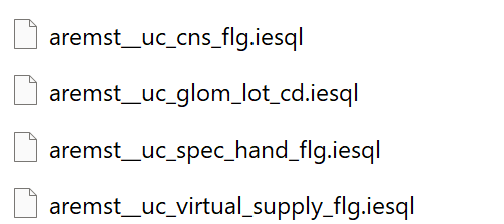
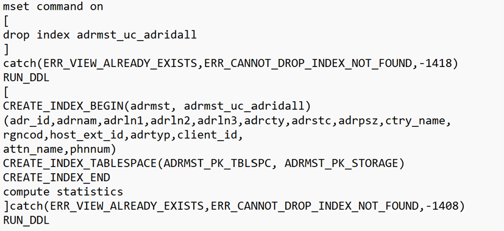
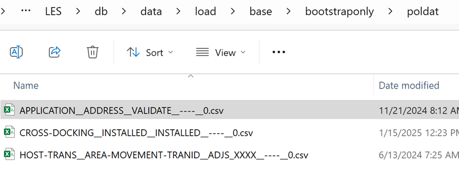
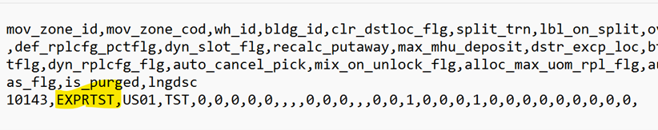
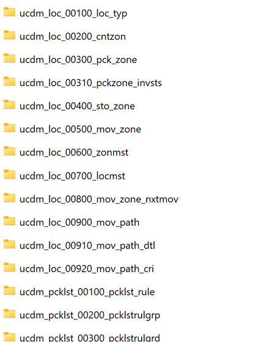
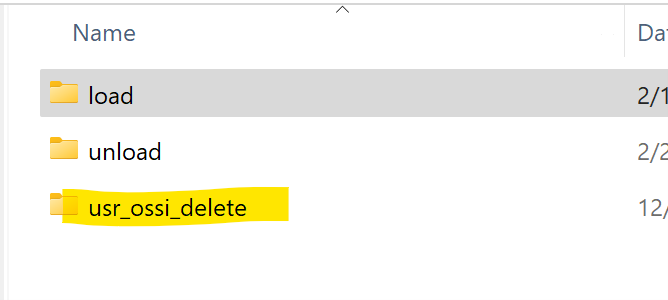
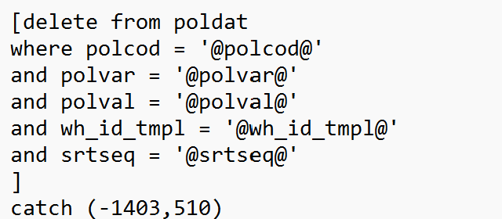
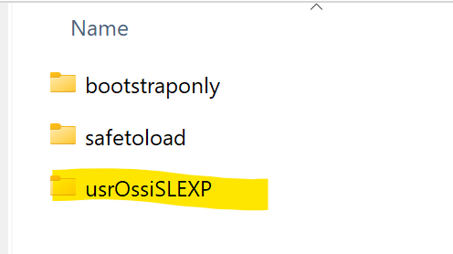
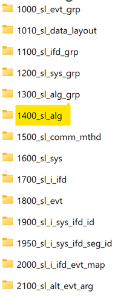
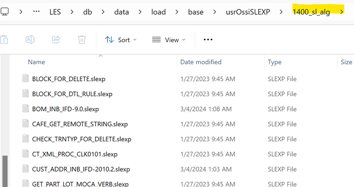

# Controlled Object Layout

SmartDevOps enforces a disciplined and consistent layout to manage different types of **controlled objects** in the Blue Yonder WMS environment. In this section, we’ll walk you through how each component is handled, and what best practices to follow so that your rollouts are clean, traceable, and consistent.

## Source Code

SmartDevOps keeps things clean and trackable. Here’s how we manage various source components:

- **MOCA Source & 3GL Logic**  
  All your custom logic is versioned and tracked within a repository. This makes it easy to trace back changes and ensure consistency across rollouts.

- **Binaries (executables, shared libraries, JARs)**  
  These are always treated as **precompiled artifacts**. That means no compiling during rollout — everything is ready to go and simply deployed.

- **Downloads, Client, and Mtfclient Components**  
  These must always have their source code maintained on the server. This keeps things transparent and reproducible.

- **Reports, Labels, and Scripts**  
  These are fully version-controlled. So every change you make is traceable — no surprises during deployment.

- **Rpweb Components**  
  Managed through MOCA and checked in from the server side. It ensures that changes are reflected properly and are easy to track.

## DDL (Data Definition Language)

When it comes to schema changes, structure and clarity are key.

- **Tables & Custom Columns**  
  Each table or column should be maintained in its **own dedicated file**. This improves visibility and makes troubleshooting much easier.

- **Avoid Generic Filenames**  
  Filenames like `jira001.sql` or `jira002.sql` aren’t helpful. Instead, name your files based on the table or object they modify — e.g., `add_column_to_orders.iesql`

  
- **Indexes**  
  - Each index must have its **own file**.
  - If you're modifying an index, include a **DROP statement** in the same file.
  - Indexes should **only be created via rollouts** — **never manually** by DBAs.
   
- **Sequences**  
  Define them clearly and ensure you have corresponding `sysctl` entries for consistency across environments.
    

## Data (Non-Delete)

For non-deletion data changes, organization is everything.

- **Folder Structure**  
  Follow the conventional `mload` style folder structure for clarity.

- **Naming Files**  
  Avoid incremental filenames like `jira001.csv`. Instead, name files based on their **primary key** or target object — this improves traceability.
  

- **Warehouse-Level Data (Optional)**  
  You may capture data at the warehouse level when necessary. Just ensure you maintain clear naming and structure.
   

- **File Management Strategy**  
  Have a consistent approach for handling files with sequence numbers to avoid confusion later.
   

- **Use Views for Exporting**  
  Always export data via **views** — this standardizes your approach and reduces errors.

- **Special Control Files**  
  Use them where needed — especially for advanced operations like conditional inserts or transformations.

## Data (Delete)

When dealing with data deletions, separation and clarity are vital.

- **Dedicated Folder**  
  Create a **separate folder** specifically for managing deletions.
  

- **Folder Structure**  
  Structure it similar to the `mload` folder — one subfolder **per table**.

- **Delete Operations**  
  - Each delete operation should have its **own file**.
  - Make sure each file references the **primary key** being deleted.
  - **Both hard and soft deletes** are supported.

- **Control Files**  
  Special control files are used to handle deletion logic properly — use them as needed for precision and reliability.

## Data (Integrator)

Integrator-related data changes have their own space:

- **Dedicated Folder**  
  Store all integrator-related data in its own **clearly named folder**.

- **Folder Structure**  
  Organize files logically by **group or function** for better readability.

- **Events and Outputs**  
  Each event should:
  - Clearly define its **arguments**.
  - Include **event outputs** that specify the correct **segments and fields** for proper execution.

---