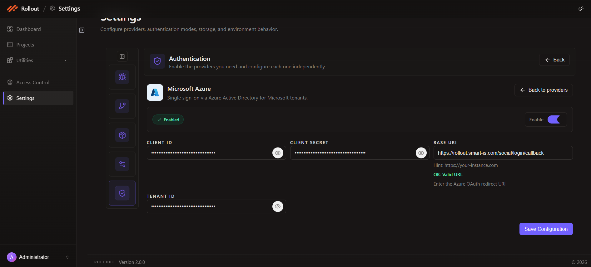

# Configure Microsoft Azure Authentication

This page explains how to configure the **Microsoft Azure** authentication provider in the current **Authentication** settings screen.

## Open Microsoft Azure Configuration

1. Open **Settings**.
2. Select **Authentication**.
3. On the **Microsoft Azure** card, click **Configure**.

## Current Microsoft Azure Screen

The Microsoft Azure provider supports Azure Active Directory sign-in for Microsoft tenants.

The current screen shows:

- provider enable toggle
- configuration status
- `Client ID`
- `Client Secret`
- `Base URI`
- `Tenant ID`
- **Save Configuration**

## Configuration Fields

The current Microsoft Azure configuration uses the following fields:

| Field | Purpose |
| --- | --- |
| `Enable` | Turns Microsoft Azure authentication on or off |
| `Client ID` | Stores the Azure application client identifier |
| `Client Secret` | Stores the Azure application secret |
| `Base URI` | Stores the Azure OAuth redirect URI used by the application |
| `Tenant ID` | Stores the Azure tenant identifier |

## Enable Or Disable Microsoft Azure Authentication

Use the **Enable** toggle to turn Microsoft Azure sign-in on or off.

You can keep the provider disabled until all Azure OAuth values are ready.

## OAuth Settings

Enter the Microsoft Azure OAuth values shown in the screen:

- `Client ID`
- `Client Secret`
- `Base URI`
- `Tenant ID`

The current screen describes the `Base URI` field as the Azure OAuth redirect URI.

## Save Configuration

After entering the Azure values:

1. review the provider status
2. confirm the client, tenant, and redirect values
3. click **Save Configuration**

---
 
