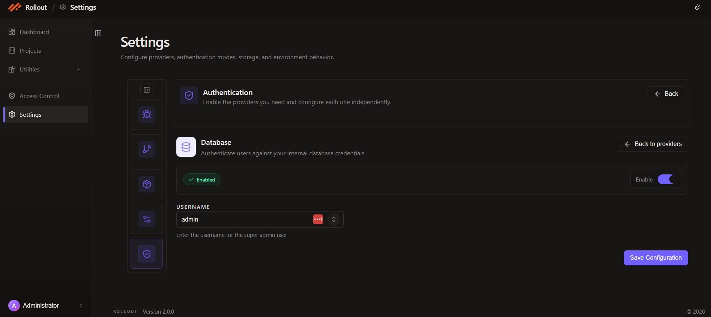

# Configure Database Authentication

This page explains how to configure the **Database** authentication provider in the current **Authentication** settings screen.

## Open Database Configuration

1. Open **Settings**.
2. Select **Authentication**.
3. On the **Database** card, click **Configure**.

## Current Database Screen

The Database provider is used to authenticate users against the application's internal database credentials.

The current screen shows:

- provider enable toggle
- configuration status
- `Username`
- **Save Configuration**



## Configuration Fields

The current Database configuration uses the following fields:

| Field | Purpose |
| --- | --- |
| `Enable` | Turns Database authentication on or off |
| `Username` | Defines the super admin user name used by the application |

## Enable Or Disable Database Authentication

Use the **Enable** toggle to turn Database authentication on or off.

When enabled:

- the provider becomes active for database-based login
- the provider status appears as configured or enabled in the Authentication screen

## Username

Use the **Username** field to define the super admin user name.

The current example shown in the UI uses:

```text
admin
```

The screen description says this value is used for the super admin user.

## Save Configuration

After reviewing the provider toggle and username:

1. confirm the value in `Username`
2. click **Save Configuration**

---
<br>
