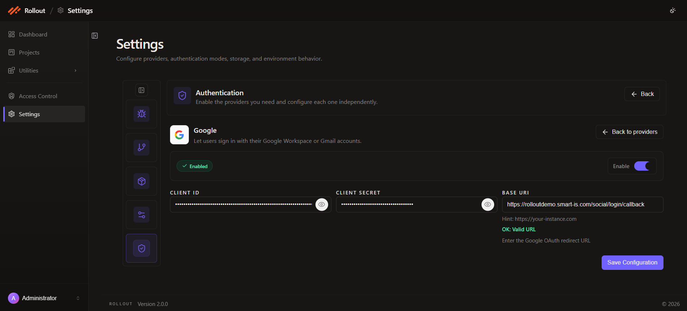

# Configure Google Authentication

This page explains how to configure the **Google** authentication provider in the current **Authentication** settings screen.

## Open Google Configuration

1. Open **Settings**.
2. Select **Authentication**.
3. On the **Google** card, click **Configure**.

## Current Google Screen

The Google provider allows users to sign in with Google Workspace or Gmail accounts.

The current screen shows:

- provider enable toggle
- configuration status
- `Client ID`
- `Client Secret`
- `Base URI`
- **Save Configuration**

## Configuration Fields

The current Google configuration uses the following fields:

| Field | Purpose |
| --- | --- |
| `Enable` | Turns Google authentication on or off |
| `Client ID` | Stores the Google OAuth client identifier |
| `Client Secret` | Stores the Google OAuth client secret |
| `Base URI` | Stores the Google OAuth redirect URI used by the application |

## Enable Or Disable Google Authentication

Use the **Enable** toggle to turn Google sign-in on or off.

This allows you to prepare the OAuth settings first and activate the provider when ready.

## OAuth Settings

Enter the Google OAuth values shown in the screen:

- `Client ID`
- `Client Secret`
- `Base URI`

The current screen describes the `Base URI` field as the Google OAuth redirect URI.

## Save Configuration

After entering the Google values:

1. review the provider status
2. confirm the client and redirect settings
3. click **Save Configuration**

---
 
