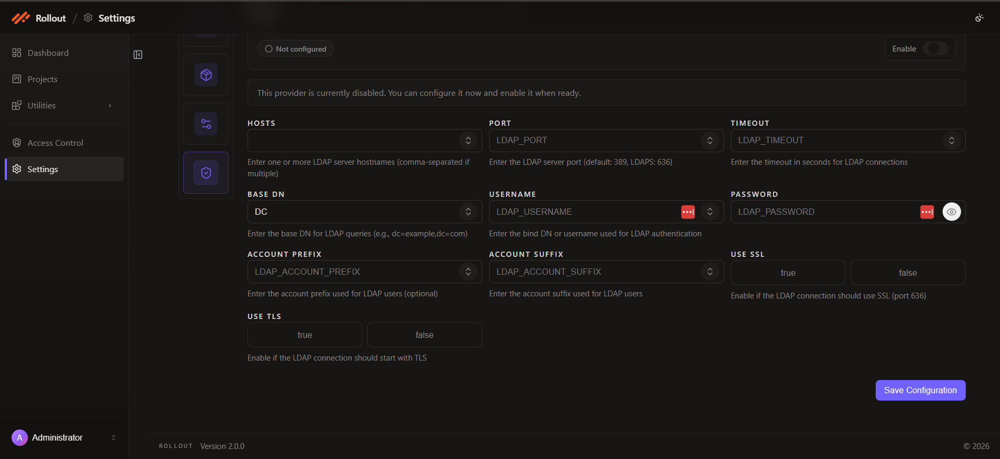

# Configure LDAP Authentication

This page explains how to configure the **LDAP** authentication provider in the current **Authentication** settings screen.

## Open LDAP Configuration

1. Open **Settings**.
2. Select **Authentication**.
3. On the **LDAP** card, click **Configure**.

## Current LDAP Screen

The LDAP provider is used for directory-based authentication through LDAP or Active Directory.

The current screen shows:

- provider enable toggle
- configuration status
- `Hosts`
- `Port`
- `Timeout`
- `Base DN`
- `Username`
- `Password`
- `Account Prefix`
- `Account Suffix`
- `Use SSL`
- `Use TLS`
- **Save Configuration**

## Configuration Fields

The current LDAP configuration uses the following fields:

| Field | Purpose |
| --- | --- |
| `Enable` | Turns LDAP authentication on or off |
| `Hosts` | Stores one or more LDAP server host names |
| `Port` | Stores the LDAP server port |
| `Timeout` | Stores the LDAP connection timeout in seconds |
| `Base DN` | Stores the base DN used for LDAP queries |
| `Username` | Stores the bind DN or LDAP user name |
| `Password` | Stores the LDAP bind password |
| `Account Prefix` | Stores the LDAP account prefix when needed |
| `Account Suffix` | Stores the LDAP account suffix when needed |
| `Use SSL` | Controls whether the LDAP connection uses SSL |
| `Use TLS` | Controls whether the LDAP connection starts with TLS |

## Provider Status

The current example shows LDAP as **Not configured** and disabled.

The screen message indicates you can configure it now and enable it when ready.

## LDAP Connection Settings

Enter the LDAP connection values shown in the screen:

- `Hosts`
- `Port`
- `Timeout`
- `Base DN`
- `Username`
- `Password`
- `Account Prefix`
- `Account Suffix`

The field descriptions on the screen also note:

- default LDAP port is typically `389`
- LDAPS commonly uses `636`

## SSL And TLS Options

Use the `Use SSL` and `Use TLS` options to control secure directory communication.

- enable `Use SSL` when the LDAP connection should use SSL
- enable `Use TLS` when the LDAP connection should start with TLS

## Save Configuration

After entering the LDAP values:

1. review the provider status
2. enable the provider when ready
3. click **Save Configuration**

---
 
