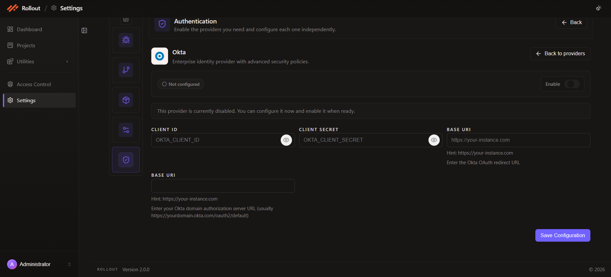

# Configure Okta Authentication

This page explains how to configure the **Okta** authentication provider in the current **Authentication** settings screen.

## Open Okta Configuration

1. Open **Settings**.
2. Select **Authentication**.
3. On the **Okta** card, click **Configure**.

## Current Okta Screen

The Okta provider is used for enterprise identity integration.

The current screen shows:

- provider enable toggle
- configuration status
- `Client ID`
- `Client Secret`
- `Base URI` for the redirect URI
- `Base URI` for the Okta authorization server URL
- **Save Configuration**



## Configuration Fields

The current Okta configuration uses the following fields:

| Field | Purpose |
| --- | --- |
| `Enable` | Turns Okta authentication on or off |
| `Client ID` | Stores the Okta application client identifier |
| `Client Secret` | Stores the Okta application secret |
| `Base URI` | Stores the Okta OAuth redirect URI |
| `Base URI` | Stores the Okta domain authorization server URL |

## Provider Status

The current example shows Okta as **Not configured** and disabled.

The page message indicates you can configure it now and enable it when ready.

## OAuth Settings

Fill in the Okta values shown on the screen:

- `Client ID`
- `Client Secret`
- the upper `Base URI` field for the redirect URI
- the lower `Base URI` field for the Okta authorization server URL

The lower field description in the UI indicates that it is usually the Okta authorization server URL such as:

```text
https://yourdomain.okta.com/oauth2/default
```

## Save Configuration

After entering the Okta values:

1. review the provider status
2. enable the provider when ready
3. click **Save Configuration**

---
<br>
