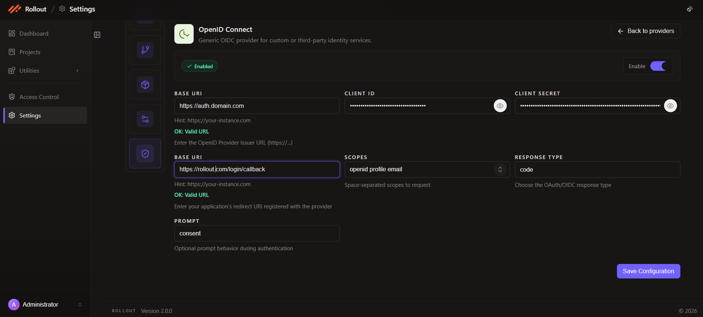

# Configure OpenID Connect Authentication

This page explains how to configure the **OpenID Connect** authentication provider in the current **Authentication** settings screen.

## Open OpenID Connect Configuration

1. Open **Settings**.
2. Select **Authentication**.
3. On the **OpenID Connect** card, click **Configure**.

## Current OpenID Connect Screen

The OpenID Connect provider supports custom or third-party OIDC identity services.

The current screen shows:

- provider enable toggle
- configuration status
- provider issuer `Base URI`
- `Client ID`
- `Client Secret`
- application redirect `Base URI`
- `Scopes`
- `Response Type`
- `Prompt`
- **Save Configuration**

## Configuration Fields

The current OpenID Connect configuration uses the following fields:

| Field | Purpose |
| --- | --- |
| `Enable` | Turns OpenID Connect authentication on or off |
| `Base URI` | Stores the OpenID provider issuer URL |
| `Client ID` | Stores the OIDC client identifier |
| `Client Secret` | Stores the OIDC client secret |
| `Base URI` | Stores the application's redirect URI registered with the provider |
| `Scopes` | Defines the requested scopes |
| `Response Type` | Defines the OAuth or OIDC response type |
| `Prompt` | Defines optional prompt behavior during authentication |

## OIDC Settings

Enter the OpenID Connect values shown in the screen:

- issuer `Base URI`
- `Client ID`
- `Client Secret`
- redirect `Base URI`
- `Scopes`
- `Response Type`
- `Prompt`

The current example shown in the UI includes:

- `Scopes`: `openid profile email`
- `Response Type`: `code`
- `Prompt`: `consent`

## Save Configuration

After entering the OIDC values:

1. review the provider status
2. confirm the issuer, redirect, and scope settings
3. click **Save Configuration**

---
 
