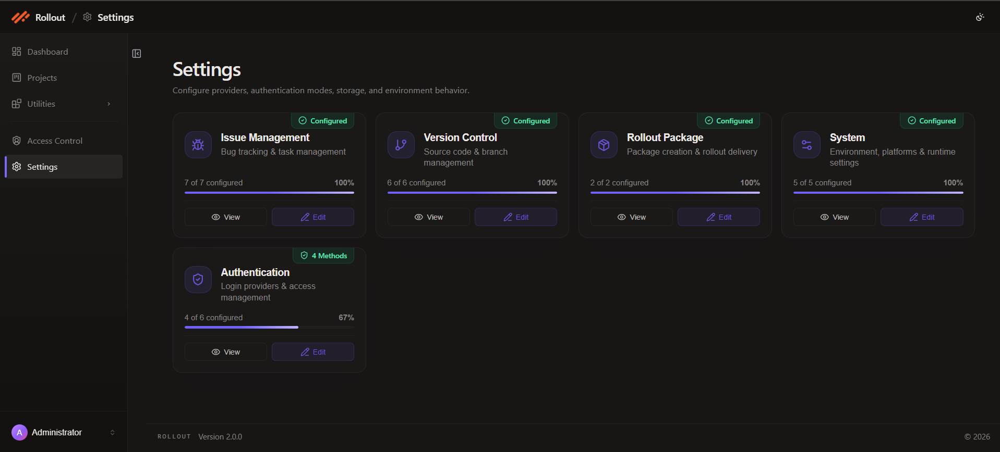
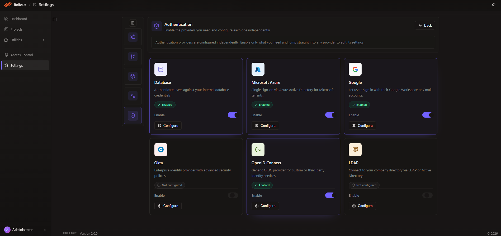

# AUTH Configuration

This page explains how to configure the current **Authentication** screen in **Settings**.

The latest screen lets you:

- enable or disable any authentication provider
- configure each provider independently
- use the **Configure** button to open provider-specific settings

Open Authentication Configuration:

1. Open **Settings** from the left navigation.
2. Find the **Authentication** card.
3. Click **Edit** to open the authentication configuration screen.

The current Authentication page uses provider cards instead of a single shared form.

Each provider is configured independently, so you can:

- enable only the methods you want to use
- leave unused methods disabled
- click **Configure** on a specific provider to manage its settings

The current screen shows these authentication providers:

- `Database`
- `Microsoft Azure`
- `Google`
- `Okta`
- `OpenID Connect`
- `LDAP`

Detailed setup guides:

- [Configure Database Authentication](/rolloutapplication/config/auth/database.md)
- [Configure Microsoft Azure Authentication](/rolloutapplication/config/auth/azure.md)
- [Configure Google Authentication](/rolloutapplication/config/auth/google.md)
- [Configure Okta Authentication](/rolloutapplication/config/auth/okta.md)
- [Configure OpenID Connect Authentication](/rolloutapplication/config/auth/openid.md)
- [Configure LDAP Authentication](/rolloutapplication/config/auth/ldap.md)

Each provider card includes:

- the provider name
- a short description
- a status label such as `Enabled` or `Not configured`
- an `Enable` toggle
- a **Configure** button

Use the **Enable** toggle on each card to turn that authentication method on or off.

This means you can:

- enable multiple authentication methods at the same time
- disable methods that are not needed
- manage each provider without affecting the others

The page is designed so authentication providers are configured independently.

To configure any authentication provider:

1. locate the provider card
2. enable it if needed
3. click **Configure**

The **Configure** button opens that provider's own settings so you can manage the required connection or login fields for that authentication method.

The current Authentication screen supports a card-based flow:

- `Database` is used for internal application credentials
- `Microsoft Azure` is used for Azure-based sign-in
- `Google` is used for Google account sign-in
- `Okta` is used for enterprise identity provider integration
- `OpenID Connect` is used for custom or third-party OIDC identity services
- `LDAP` is used for directory-based authentication

You can enable and configure these providers one by one based on your environment.

- enabled providers show their status directly on the card
- providers that are not ready yet can remain disabled
- configuration is not done from the toggle alone; use **Configure** to manage provider settings

---
 
