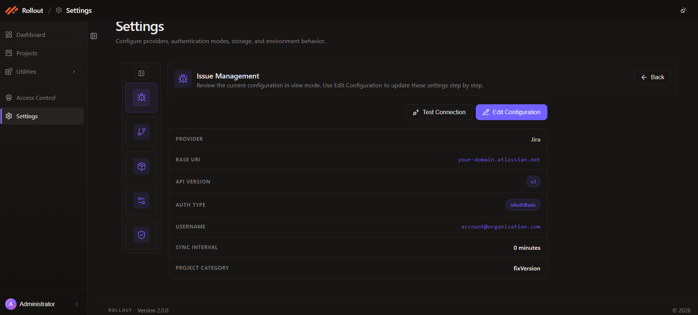
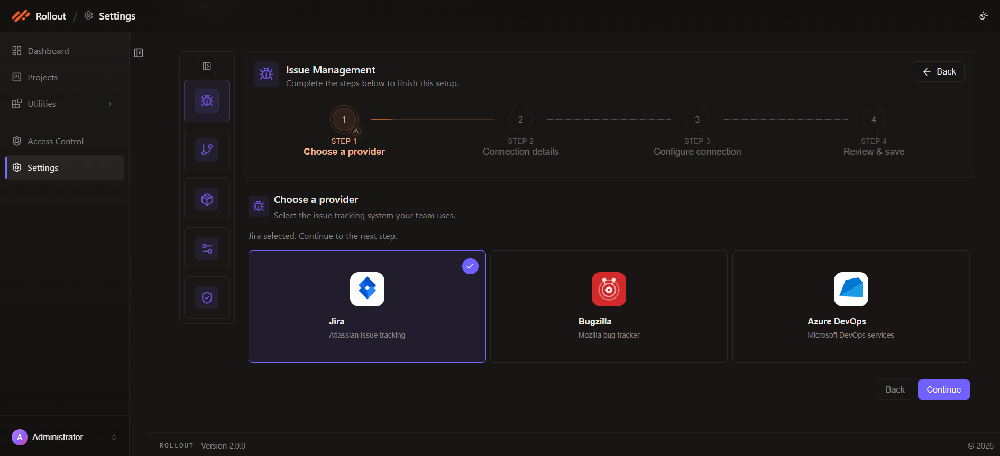
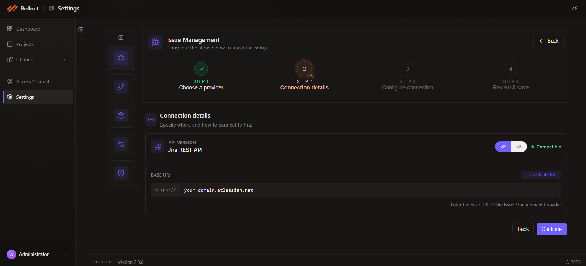
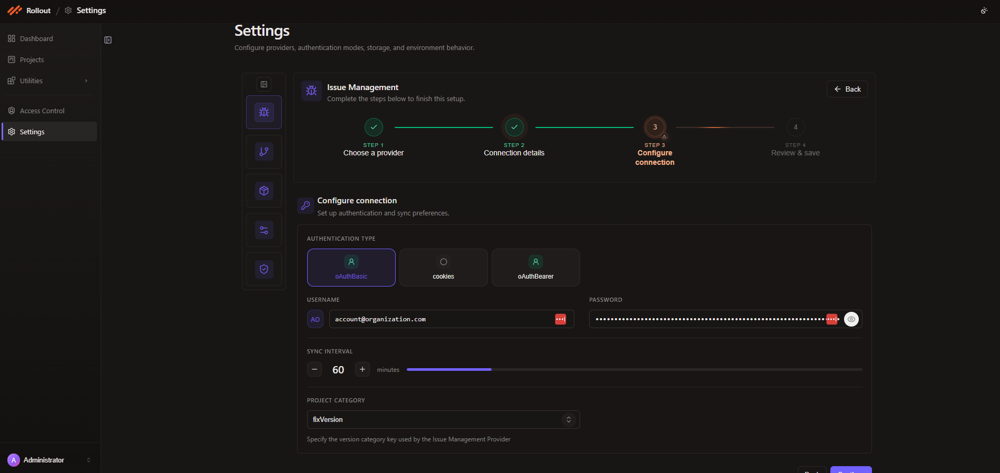
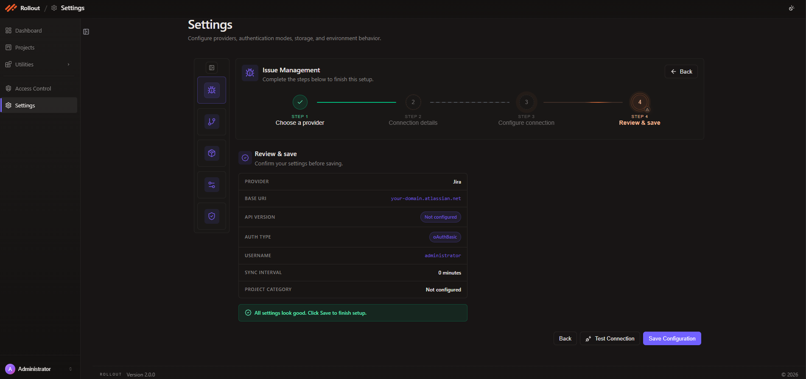
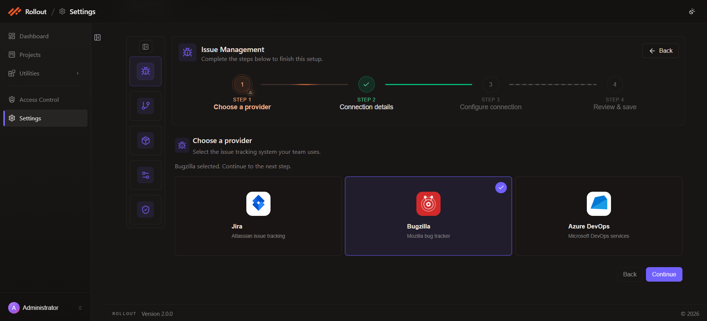
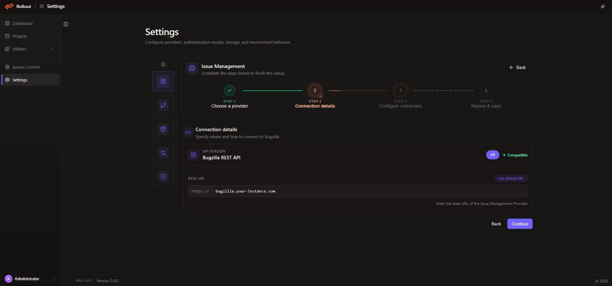
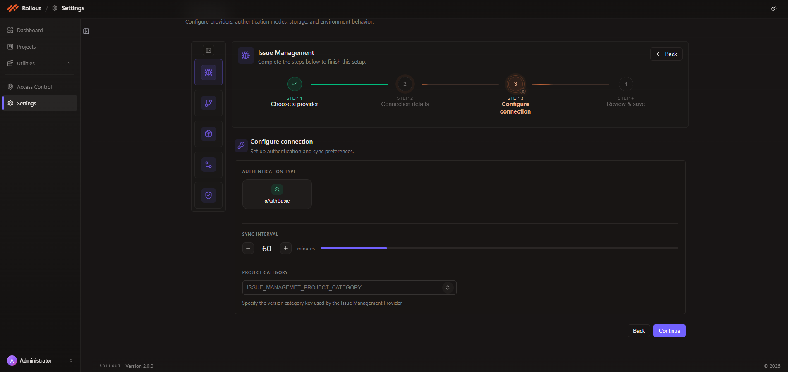
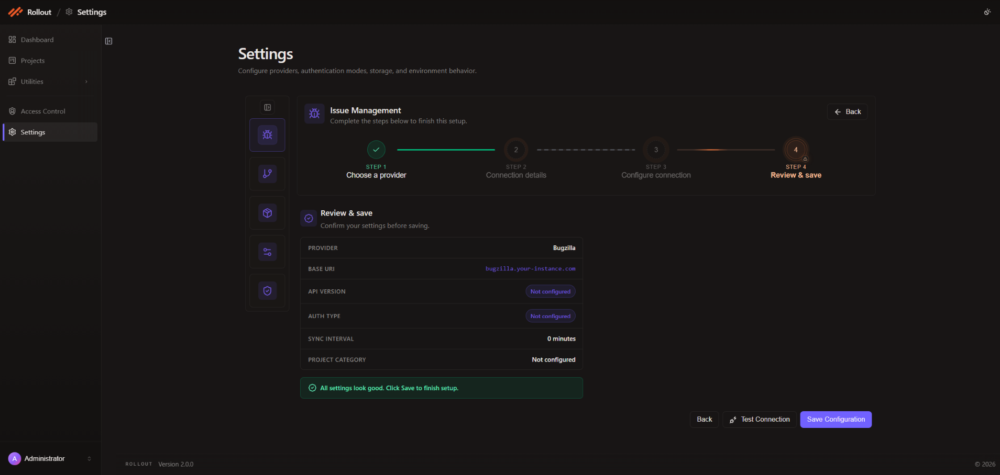

# Issue Management Provider

The Issue Management Provider screen connects Rollout to your issue tracking system so rollout metadata, bug references, and version categories stay aligned with your delivery workflow.

The current Issue Management wizard shows **Jira**, **Bugzilla**, and **Azure DevOps** provider options. If you need to configure a Git-based repository connection, use the **Version Control** configuration screens instead of Issue Management.

## Open Issue Management

1. Go to **Settings** from the left navigation.
2. Open **Issue Management**.
3. On the view screen, review the current configuration details: `Provider`, `Base URI`, `API Version`, `Auth Type`, `Username`, `Sync Interval`, and `Project Category`.
4. Use **Test Connection** to validate the current setup, or click **Edit Configuration** to update it through the guided wizard.

## Configure Issue Management Providers

1. Click **Edit Configuration**.
2. In **Step 1 - Choose a provider**, select the issue tracking system your team uses.
3. Continue through the provider-specific setup flow below.

Provider-specific setup guides:
- [Jira Integration Setup](/rolloutapplication/config/issue/jira.md)
- [Bugzilla Integration Setup](/rolloutapplication/config/issue/bugzilla.md)
- [Azure Integration Setup](/rolloutapplication/config/issue/azure.md)

### Jira

1. In **Step 1 - Choose a provider**, select **Jira** and click **Continue**.

2. In **Step 2 - Connection details**, review the **Jira REST API** option, choose the supported API version shown in the UI (`v2` or `v3`), enter the Jira **Base URI**, and use **Use default URL** if you want to restore the default format. Click **Continue** when the connection details are correct.

3. In **Step 3 - Configure connection**, choose the authentication type shown for your environment, then complete `Authentication Type`, `Username`, `Password`, `Sync Interval`, and `Project Category`. Click **Continue** after the form is complete.

4. In **Step 4 - Review & save**, confirm the Jira settings, optionally click **Test Connection**, and then click **Save Configuration**.

### Bugzilla

1. In **Step 1 - Choose a provider**, select **Bugzilla** and click **Continue**.

2. In **Step 2 - Connection details**, review the **Bugzilla REST API** option, confirm the compatible API version badge (`v1`), enter the Bugzilla **Base URI**, and use **Use default URL** if needed. Click **Continue** to move to the next step.

3. In **Step 3 - Configure connection**, complete the Bugzilla configuration fields shown in the form. The current UI includes `Authentication Type`, `Username`, `Password`, `Sync Interval`, and `Project Category`.

4. In **Step 4 - Review & save**, verify the Bugzilla provider details, run **Test Connection** if required, and click **Save Configuration** to finish.

### Azure DevOps

1. In **Step 1 - Choose a provider**, select **Azure DevOps** and click **Continue**.

2. In **Step 2 - Connection details**, review the **Azure DevOps API** option, confirm the compatible API version badge (`v5`), enter the Azure DevOps **Base URI**, and use **Use default URL** when you want to restore the default value. Click **Continue** to proceed.

3. In **Step 3 - Configure connection**, complete the same connection form used by the wizard for credentials and sync settings. Fill in `Authentication Type`, `Username`, `Password`, `Sync Interval`, and `Project Category`, then click **Continue**.

4. In **Step 4 - Review & save**, confirm the Azure DevOps settings, optionally use **Test Connection**, and click **Save Configuration**.

---
 
