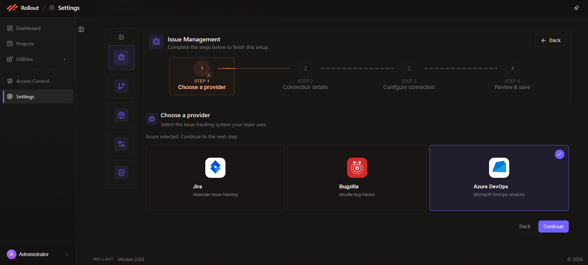
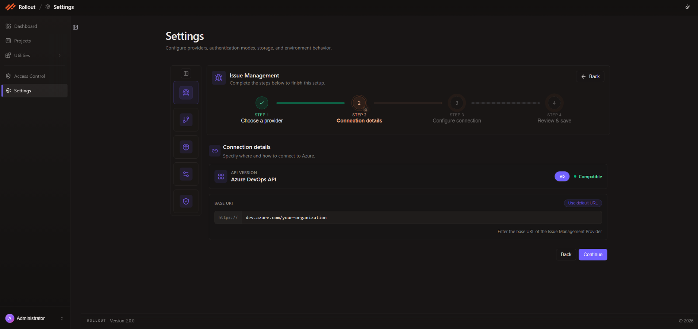
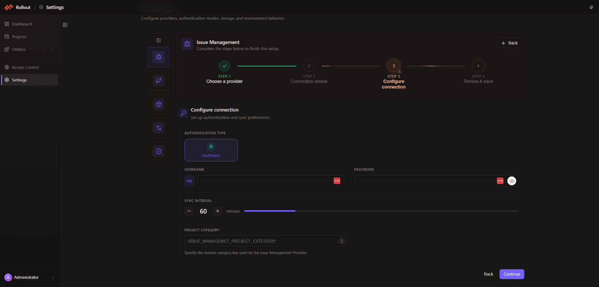
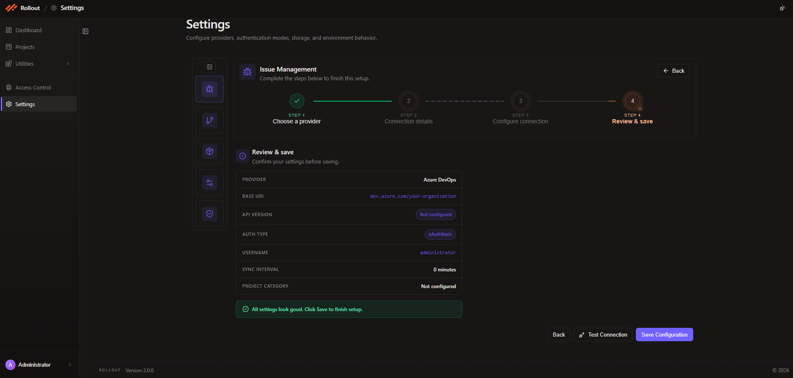
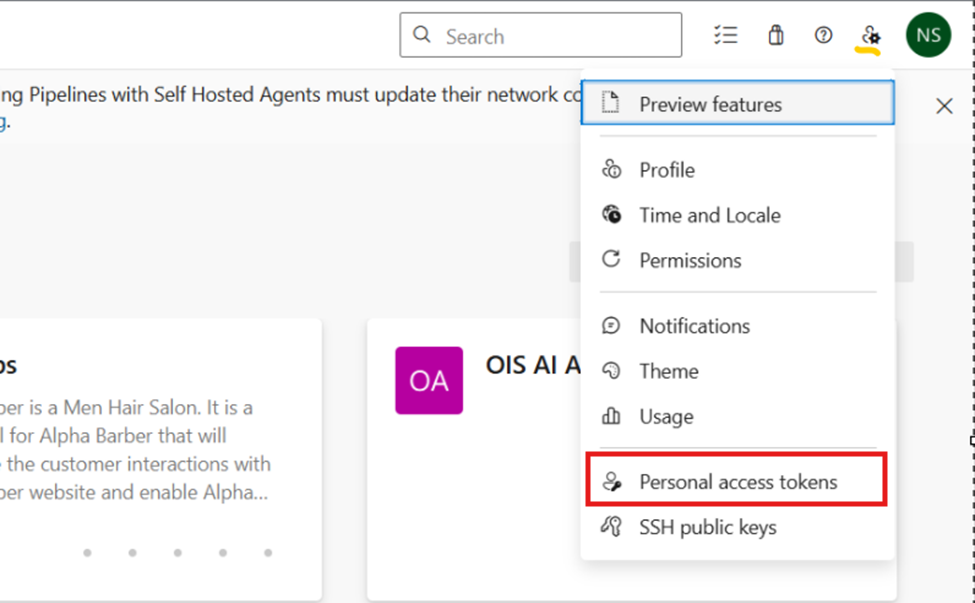

# Azure Integration Setup

This page explains how to configure **Azure DevOps** as the Issue Management Provider in Rollout.

## Configuration Fields for Azure DevOps

The current Azure DevOps setup uses the following fields in the wizard:

| Field | Value |
| --- | --- |
| Provider | `Azure DevOps` |
| API Version | `v5` |
| Base URI | `https://dev.azure.com/your-organization` |
| Authentication Type | `oAuthBasic` |
| Username | Azure DevOps user account |
| Password / Token | Azure DevOps personal access token |
| Sync Interval | Set in minutes |
| Project Category | Version category key used by your Azure DevOps integration, if required |

The current Azure DevOps wizard uses these fields across the connection details, authentication, and review steps.

## Step 1 - Choose a Provider

1. Open **Settings**.
2. Select **Issue Management**.
3. Click **Edit Configuration**.
4. In **Step 1 - Choose a provider**, select **Azure DevOps** and click **Continue**.

## Step 2 - Connection Details

In **Step 2 - Connection details**:

- Review the **Azure DevOps API** connection type.
- Confirm the compatible API version badge, `v5`.
- Enter the Azure DevOps **Base URI**.
- Use **Use default URL** if you need to restore the default value.
- Click **Continue** to proceed to the next step.

## Step 3 - Configure Connection

In **Step 3 - Configure connection**:

- Confirm the authentication type shown in the current UI.
- Enter the Azure DevOps `Username`.
- Enter the Azure DevOps `Password` or personal access token.
- Set the `Sync Interval` in minutes.
- Select the `Project Category` when your setup requires one.
- Click **Continue** after filling in the required values.

## Step 4 - Review & Save

In **Step 4 - Review & save**:

- Review `Provider`, `Base URI`, `API Version`, `Auth Type`, `Username`, `Sync Interval`, and `Project Category`.
- Click **Test Connection** if you want to validate the Azure DevOps connection before saving.
- Click **Save Configuration** to complete the setup.

## How to Generate an Azure DevOps PAT

1. Sign in to Azure DevOps.
2. Open your profile menu.
3. Navigate to **Personal Access Tokens**.
4. Create a new token with the scopes required by your environment.
5. Copy the token and use it in the Azure DevOps password or token field in Rollout.

---
 
