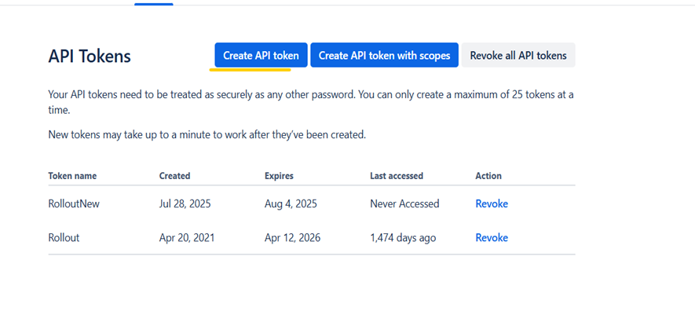
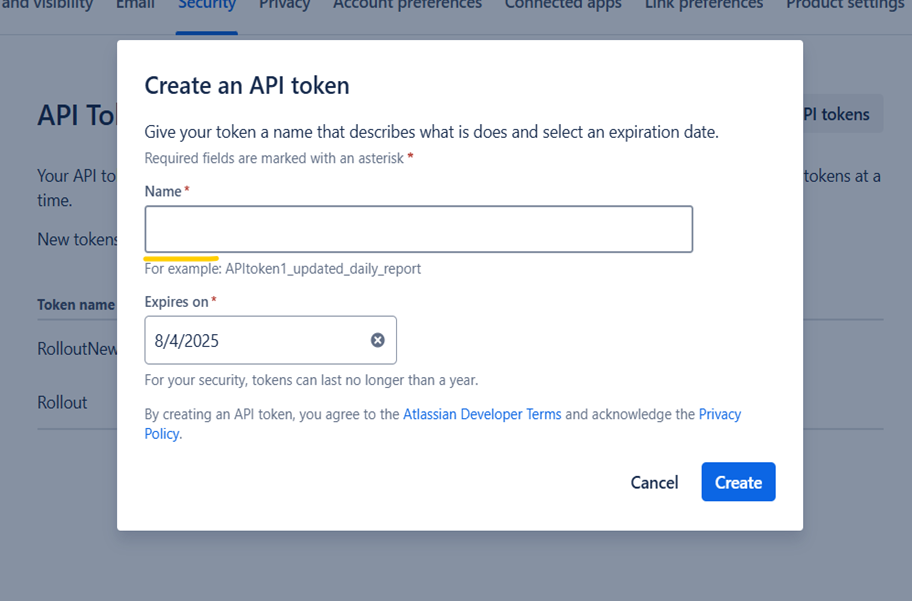

# Jira Integration Setup

This page explains how to configure **Jira** as the Issue Management Provider in Rollout.

## Configuration Fields for Jira

The current Jira setup uses the following fields in the wizard:

| Field | Value |
| --- | --- |
| Provider | `Jira` |
| API Version | `v2` or `v3` |
| Base URI | `https://your-domain.atlassian.net` |
| Authentication Type | `oAuthBasic` |
| Username | Jira user account |
| Password / Token | Atlassian API token |
| Sync Interval | Set in minutes |
| Project Category | `fixVersion` or the version category used in your Jira instance |

The current Jira wizard uses these fields across the connection details, authentication, and review steps.

## Step 1 - Choose a Provider

1. Open **Settings**.
2. Select **Issue Management**.
3. Click **Edit Configuration**.
4. In **Step 1 - Choose a provider**, select **Jira** and click **Continue**.

## Step 2 - Connection Details

In **Step 2 - Connection details**:

- Review the **Jira REST API** connection type.
- Select the supported API version shown in the UI, `v2` or `v3`.
- Enter the Jira **Base URI**.
- Use **Use default URL** if you need to restore the default base URL format.
- Click **Continue** to move to the next step.

## Step 3 - Configure Connection

In **Step 3 - Configure connection**:

- Choose the Jira authentication type shown in the current UI.
- Enter the Jira `Username`.
- Enter the Jira `Password` or API token.
- Set the `Sync Interval` in minutes.
- Select the `Project Category` used for Jira version mapping.
- Click **Continue** when all required values are filled in.

## Step 4 - Review & Save

In **Step 4 - Review & save**:

- Review `Provider`, `Base URI`, `API Version`, `Auth Type`, `Username`, `Sync Interval`, and `Project Category`.
- Click **Test Connection** if you want to validate the Jira connection before saving.
- Click **Save Configuration** to finish the setup.

## How to Generate a Jira API Token

1. Sign in to your Atlassian account.
2. Open the Atlassian security page for API tokens.
3. Click **Create API token**.

4. Enter a token name and generate the token.
5. Copy the generated token and use it in the Jira password or token field in Rollout.

---
 
