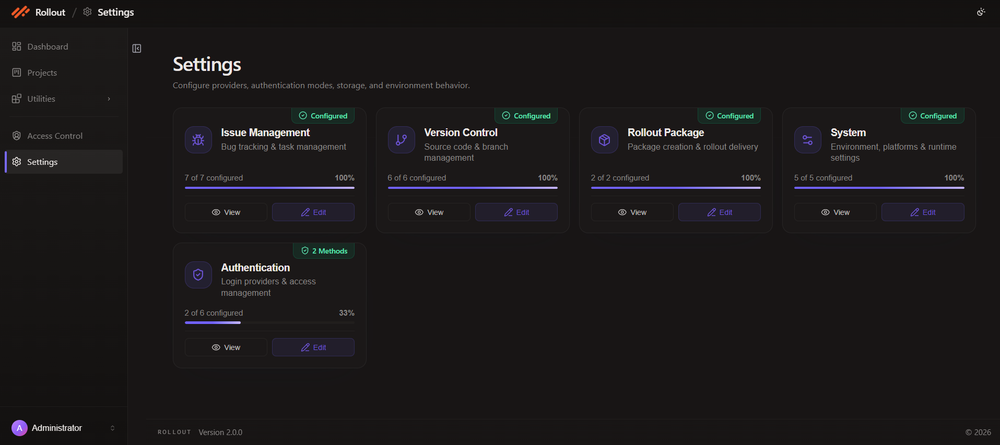
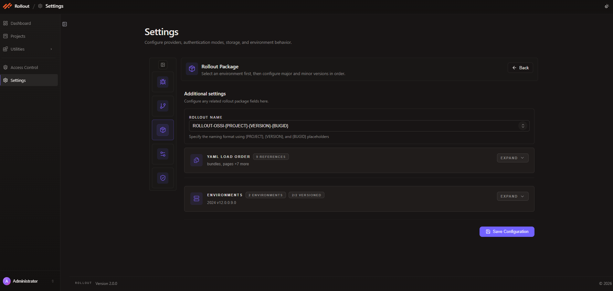
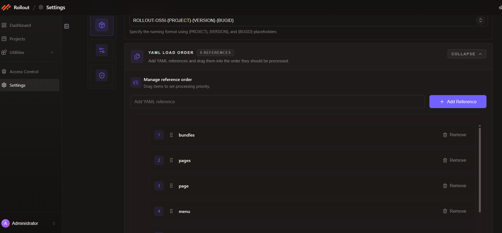
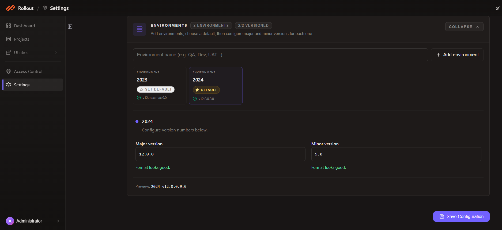

# Rollout Package Configuration

This page explains how to configure the current **Rollout Package** screen in **Settings**.

The latest screen lets you:

- define the rollout naming pattern
- control the sequence of YAML references used in the manifest
- define the environment for which rollouts are created
- assign major and minor versions for each environment

## Open Rollout Package Configuration

1. Open **Settings** from the left navigation.
2. Find the **Rollout Package** card.
3. Click **Edit** to open the configuration screen.



## Current Rollout Package Screen

The current Rollout Package page is a single configuration screen with three main areas:

- `Rollout Name`
- `YAML Load Order`
- `Environments`

Click **Save Configuration** after reviewing all sections.



## Configuration Fields

The current Rollout Package setup uses the following fields:

| Field | Purpose |
| --- | --- |
| `Rollout Name` | Defines the rollout naming template using placeholders such as `{PROJECT}`, `{VERSION}`, and `{BUGID}` |
| `YAML Load Order` | Defines the sequence in which manifest file references are processed |
| `Environments` | Defines the environment entries available for rollout creation |
| `Default Environment` | Marks the environment used by default |
| `Major Version` | Stores the major version value for the selected environment |
| `Minor Version` | Stores the minor version value for the selected environment |
| `Preview` | Shows the final environment version format before saving |

## Rollout Name

Use the **Rollout Name** field to define the package naming convention.

The current screen shows this format:

```text
ROLLOUT-OSSI-{PROJECT}-{VERSION}-{BUGID}
```

This pattern supports:

- `{PROJECT}` for the project name or identifier
- `{VERSION}` for the rollout version
- `{BUGID}` for the linked bug or issue ID

## YAML Load Order

The **YAML Load Order** section is where you define the sequence of files used in the rollout manifest.

In this section you can:

1. add a new YAML reference
2. drag references up or down to set processing priority
3. remove references that are no longer required

The current example shows a reference list that includes entries such as:

- `bundles`
- `pages`
- `page`
- `menu`

This order controls how manifest file references are processed when the rollout package is prepared.



## Environments

The **Environments** section defines the environment for which you are creating rollouts.

In the current UI you can:

1. add environment names such as `QA`, `Dev`, `UAT`, `2023`, or `2024`
2. mark one environment as the default
3. assign the `Major version` and `Minor version` for the selected environment
4. review the generated version preview before saving

The current example shows:

- environment `2024` marked as **Default**
- environment `2023` also available
- major version `12.0.0`
- minor version `9.0`
- preview value `2024 v12.0.0.9.0`



## Save Configuration

After updating the rollout name, manifest file order, and environment versions:

1. review the screen values
2. confirm the selected default environment
3. click **Save Configuration**

---
<br>
