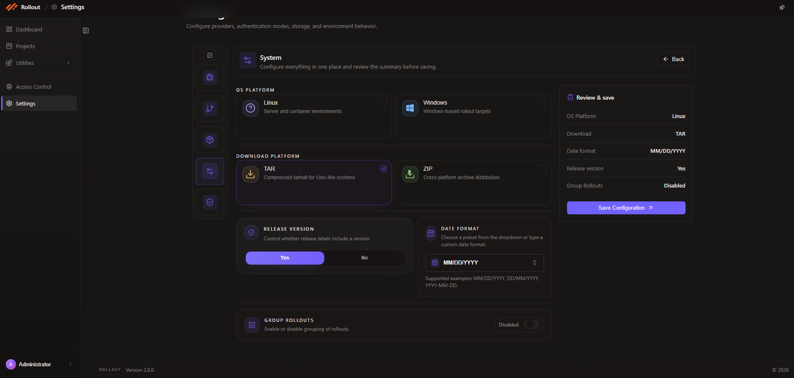

# System Configuration

This page explains how to configure the current **System** settings screen in **Settings**.

The latest screen lets you manage:

- `OS Platform`
- `Download Platform`
- `Release Version`
- `Date Format`
- `Group Rollouts`

## Open System Configuration

1. Open **Settings** from the left navigation.
2. Find the **System** card.
3. Click **Edit** to open the system configuration screen.


## Current System Screen

The current System page keeps all platform-level rollout behavior in one place and shows a live review summary before saving.

The screen includes:

- OS platform selection
- download format selection
- release version toggle
- date format selection
- group rollout toggle
- review and save panel



## Configuration Fields

The current System configuration uses the following fields:

| Field | Purpose |
| --- | --- |
| `OS Platform` | Defines whether the rollout target is `Linux` or `Windows` |
| `Download Platform` | Defines the package download format such as `TAR` or `ZIP` |
| `Release Version` | Controls whether rollout release labels include a version |
| `Date Format` | Sets the display format used for dates in the application |
| `Group Rollouts` | Enables or disables grouping of rollout items by rollout name on the Rollout List page |

## OS Platform

Use **OS Platform** to select the environment type that rollout packages are intended for.

The current options shown in the UI are:

- `Linux`
- `Windows`

Select the option that matches your rollout target platform.

## Download Platform

Use **Download Platform** to choose the archive format generated for rollout downloads.

The current options shown in the UI are:

- `TAR`
- `ZIP`

Choose the format that best fits your deployment process.

## Release Version

Use **Release Version** to control whether release labels should include version information.

The current UI shows a simple toggle with:

- `Yes`
- `No`

Enable this when your rollout process depends on versioned release labels.

## Date Format

Use **Date Format** to choose how dates are displayed across the rollout application.

The current screen supports preset or custom date values. The example shown in the UI uses:

```text
MM/DD/YYYY
```

The screen also indicates supported examples such as:

- `MM/DD/YYYY`
- `DD/MM/YYYY`
- `YYYY-MM-DD`

## Group Rollouts

Use **Group Rollouts** to control grouping behavior on the **Rollout List** page.

When this option is enabled:

- rollouts are grouped based on rollout name
- related rollout entries are easier to review together in the list

When this option is disabled:

- rollout entries appear without name-based grouping

This setting is useful when multiple generated rollouts share the same naming pattern and you want the Rollout List page to organize them together automatically.

## Review & Save

The right-side **Review & save** panel summarizes the selected values before you save.

The current summary includes:

- OS Platform
- Download
- Date format
- Release version
- Group Rollouts

After reviewing the selected values, click **Save Configuration**.

---
<br>
