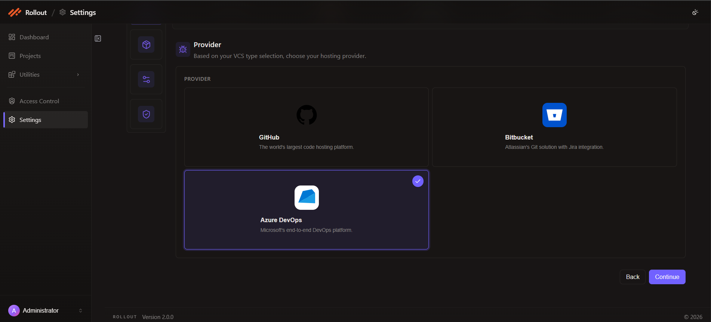
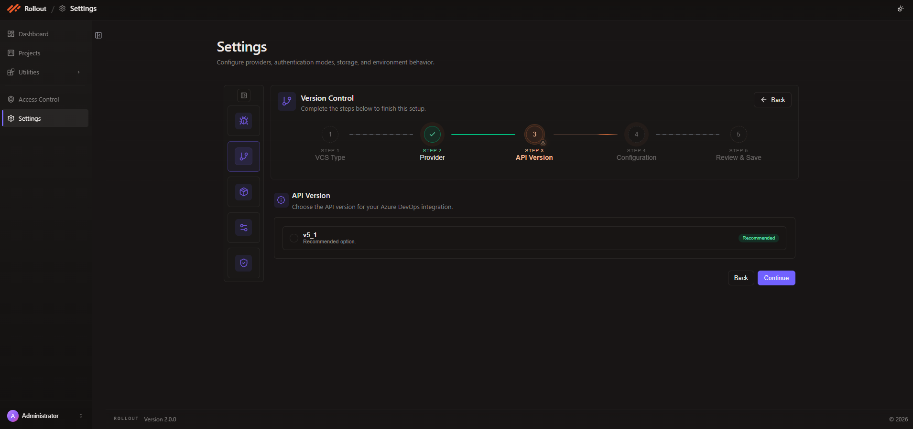
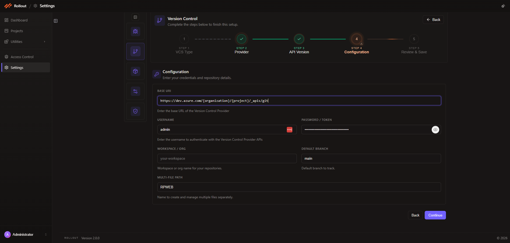
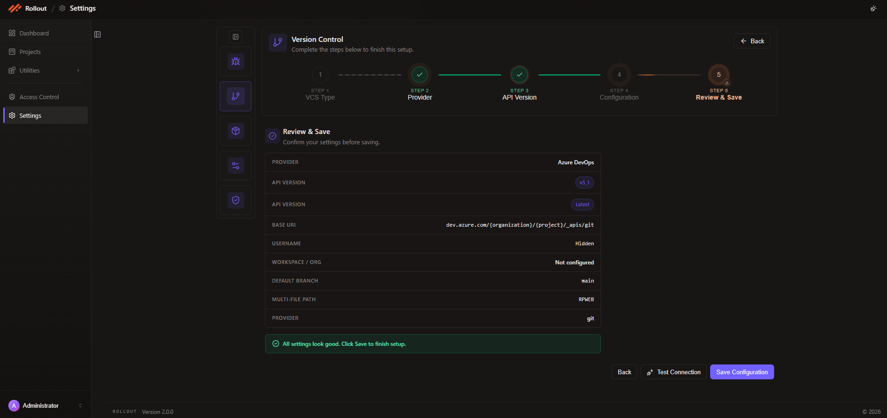

# Configure Azure DevOps Integration

This page explains how to configure **Azure DevOps** in the current Version Control Provider wizard.

## Configuration Fields for Azure DevOps

The current Azure DevOps setup uses the following values across the wizard:

| Field | Value |
| --- | --- |
| VCS Type | `Git` |
| Provider | `Azure DevOps` |
| API Version | `v5_1` |
| Base URI | `https://dev.azure.com/{organization}/{project}/_apis/git` |
| Username | Azure DevOps user account |
| Password / Token | Azure DevOps personal access token |
| Workspace / Org | Repository owner, organization, or workspace value used by your setup |
| Default Branch | Repository default branch, such as `main` |
| Multi-File Path | Repository file path or folder name, such as `RPWEB` |

## Step 1 - VCS Type

1. Open **Settings**.
2. Select **Version Control**.
3. Click **Edit**.
4. In **Step 1 - VCS Type**, choose **Git** and click **Continue**.

## Step 2 - Provider

1. In **Step 2 - Provider**, select **Azure DevOps** from the available Git hosting providers.
2. Click **Continue** to move to the API version step.

The current Provider step for Git-based integrations shows the available hosting options before you continue with the Azure DevOps-specific API version and repository settings.

## Step 3 - API Version

In **Step 3 - API Version**:

- Review the Azure DevOps API version options.
- The current UI shows `v5_1`.
- The screen marks it as the recommended option.
- Click **Continue** after confirming the version.

## Step 4 - Configuration

In **Step 4 - Configuration**, enter the repository connection values shown in the current UI:

- `Base URI`
- `Username`
- `Password / Token`
- `Workspace / Org`
- `Default Branch`
- `Multi-File Path`

Click **Continue** after completing the form.

## Step 5 - Review & Save

In **Step 5 - Review & Save**:

- Review the selected provider, API version, base URI, username state, workspace or org value, default branch, and multi-file path.
- Use **Test Connection** if you want to validate the Azure DevOps connection before saving.
- Click **Save Configuration** to complete the setup.

---
 
