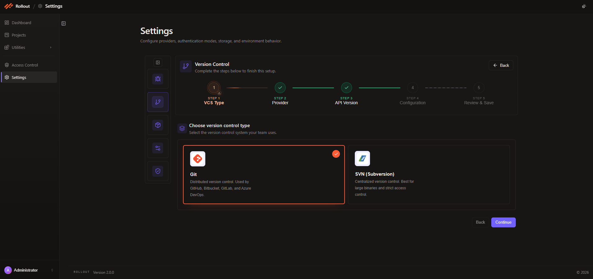
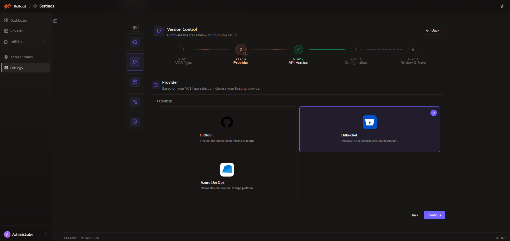
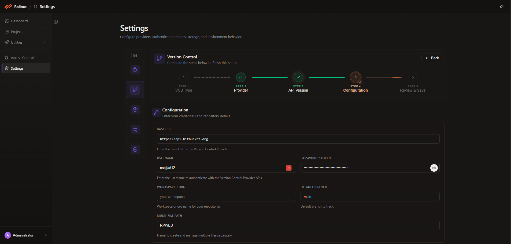
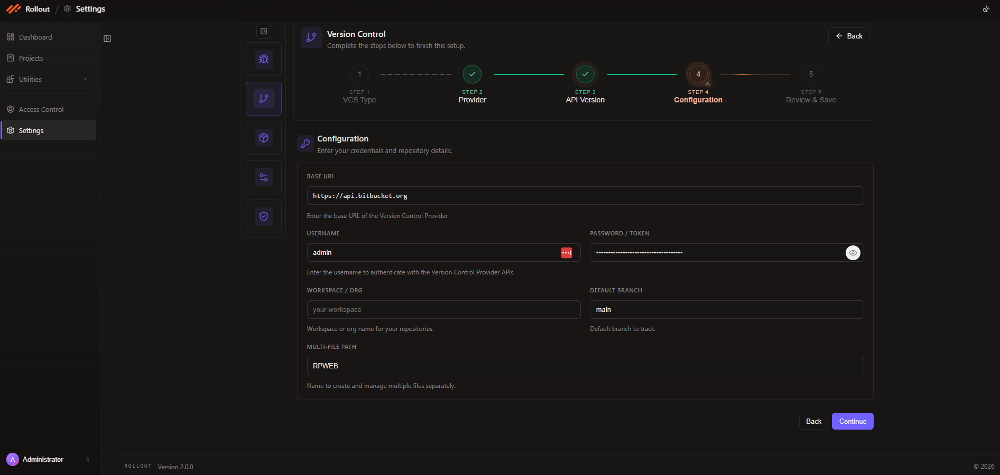
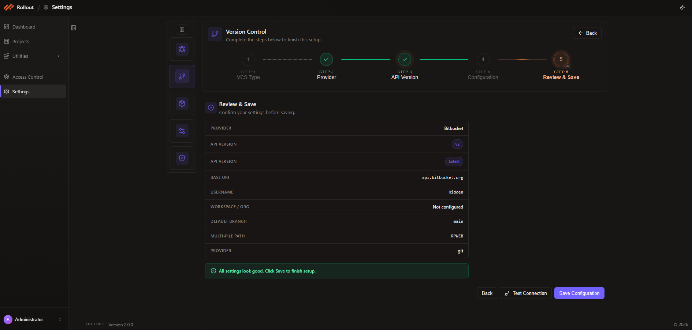

# Configure Bitbucket Integration

This page explains how to configure **Bitbucket** in the current Version Control Provider wizard.

## Configuration Fields for Bitbucket

The current Bitbucket setup uses the following values across the wizard:

| Field | Value |
| --- | --- |
| VCS Type | `Git` |
| Provider | `Bitbucket` |
| API Version | `v1` or `v2` |
| Base URI | `https://api.bitbucket.org` |
| Username | Bitbucket user account |
| Password / Token | Bitbucket app password or access token |
| Workspace / Org | Bitbucket workspace name |
| Default Branch | Repository default branch, such as `main` |
| Multi-File Path | Repository file path or folder name, such as `RPWEB` |

## Step 1 - VCS Type

1. Open **Settings**.
2. Select **Version Control**.
3. Click **Edit**.
4. In **Step 1 - VCS Type**, choose **Git** and click **Continue**.

## Step 2 - Provider

1. In **Step 2 - Provider**, review the available Git hosting options.
2. Select **Bitbucket**.
3. Click **Continue** to move to the API version step.

## Step 3 - API Version

In **Step 3 - API Version**:

- Review the available Bitbucket API versions.
- The current screen shows `v1` as a recommended option.
- The screenshot also shows `v2` selected as a supported version.
- Click **Continue** after confirming the version you want to use.

## Step 4 - Configuration

In **Step 4 - Configuration**, complete the repository connection details:

- `Base URI`
- `Username`
- `Password / Token`
- `Workspace / Org`
- `Default Branch`
- `Multi-File Path`

After entering the required values, click **Continue**.

## Step 5 - Review & Save

In **Step 5 - Review & Save**:

- Verify the selected provider and API version.
- Review the saved `Base URI`, username state, workspace or org value, default branch, and multi-file path.
- Use **Test Connection** if needed.
- Click **Save Configuration** to finish the setup.

---
 
