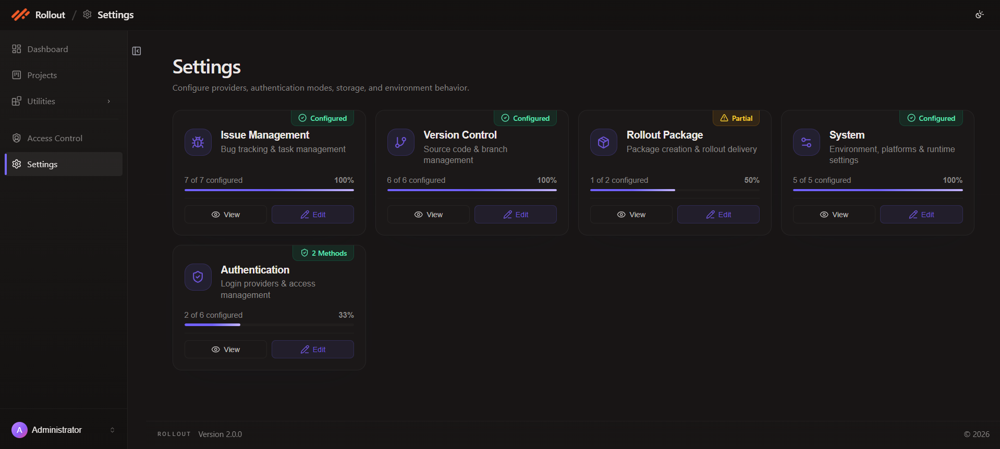

# Version Control Provider

The Version Control Provider wizard connects Rollout to your source control system so rollout files can be created, versioned, and managed from the repository settings your team uses.

The current wizard is a **5-step flow**:

1. `VCS Type`
2. `Provider`
3. `API Version`
4. `Configuration`
5. `Review & Save`

## Open Version Control

1. Go to **Settings** from the left navigation.
2. Find the **Version Control** card.
3. Click **Edit** to open the guided setup flow.

## Configure Version Control Providers

1. In **Step 1 - VCS Type**, choose the version control system your team uses.
2. The current UI shows `Git` and `SVN (Subversion)` as the available VCS types.
3. Select the required option and click **Continue**.

4. If you choose **Git**, continue to **Step 2 - Provider** and select the hosting provider for the repository integration.
5. The current Provider step shows `GitHub`, `Bitbucket`, and `Azure DevOps`.

6. After the provider is selected, continue with the provider-specific **API Version**, **Configuration**, and **Review & Save** steps.

Provider-specific setup guides:
- [Configure Bitbucket Integration](/rolloutapplication/config/version/bitbucket.md)
- [Configure GitHub Integration](/rolloutapplication/config/version/github.md)
- [Configure Azure DevOps Integration](/rolloutapplication/config/version/azureversion.md)

## Notes

- The screenshots provided for the current flow show the complete **Git** setup path.
- `SVN (Subversion)` appears in the VCS Type step, but the later provider-specific screenshots supplied for this update are for Git-based providers only.
- In the current review screens, the summary table may show both the selected provider details and the selected VCS type.

---
 
