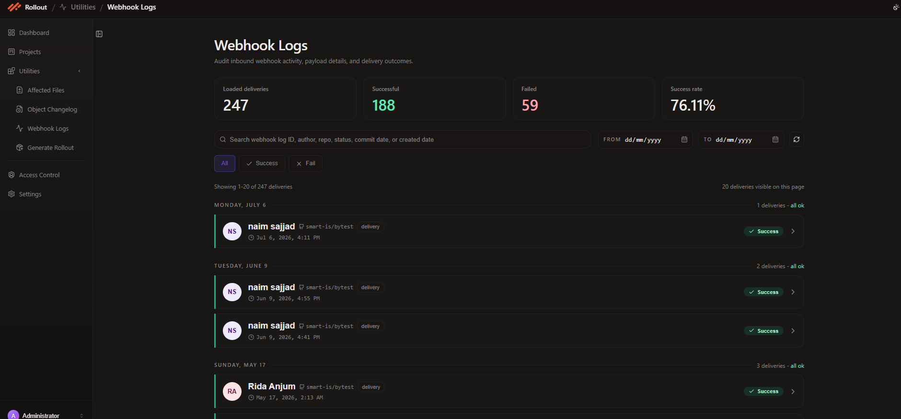
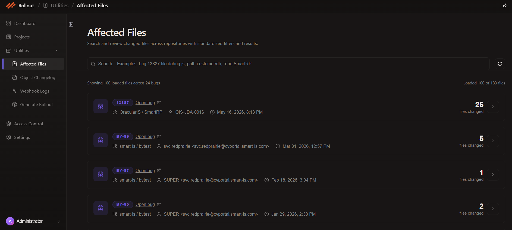
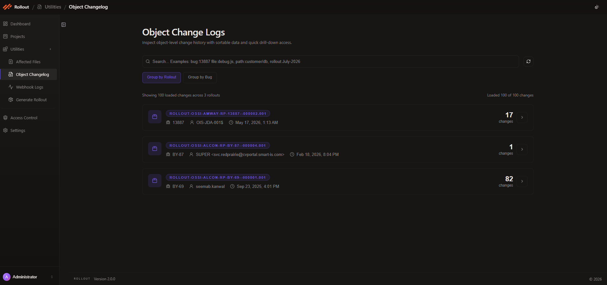
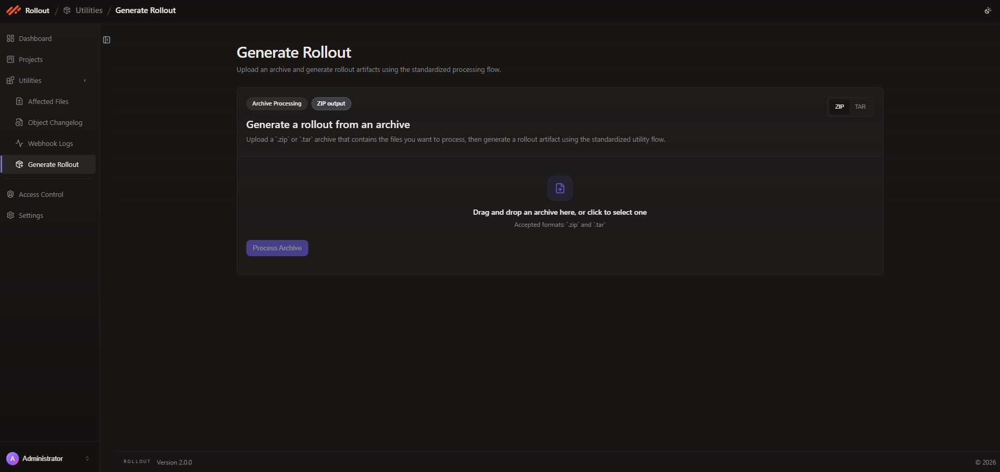

# Logs and Utilites

The logs and utilities features help you monitor and understand what’s happening across the system. They provide access to activity records, debugging options for integrations, and useful metadata such as webhook logs, impacted files, and the history of object changes. 

## Webhook Logs

The **Webhook Logs** page helps you audit inbound webhook activity, payload delivery results, and recent integration events.

1. Open **Utilities** from the left navigation.
2. Select **Webhook Logs**.
3. Review the summary cards at the top of the page:

- **Loaded deliveries**
- **Successful**
- **Failed**
- **Success rate**

4. Use the available filters to narrow the results:

- the search box for webhook log ID, author, repo, status, commit date, or created date
- the **From** and **To** date filters
- the **All**, **Success**, and **Fail** status tabs
- the refresh action to reload the latest deliveries

5. Review the delivery list grouped by day.

Each delivery row shows the author, repository, delivery type, timestamp, and current result status.

6. Click a delivery row action on the right to inspect a specific webhook entry in more detail.

     
      

---

## Affected Files

The **Affected Files** page helps you search and review changed files across repositories with standardized filters and results.

1. Open **Utilities** from the left navigation.
2. Select **Affected Files**.
3. Use the search bar to filter results with values such as:

- `bug:13887`
- `file:debug.js`
- `path:customer/db`
- `repo:SmartRP`

4. Use the refresh action to reload the latest affected file data.
5. Review the result summary shown above the list, including the number of loaded files, total bugs, and visible file count.
6. Inspect each result row to review:

- the bug ID
- the **Open bug** link
- the repository or project
- the author
- the timestamp
- the number of files changed

7. Click the row action on the right to open the affected file details for a specific bug entry.

     
      

## Object Changelog

The **Object Changelog** page helps you inspect object-level change history with sortable data and quick drill-down access.

1. Open **Utilities** from the left navigation.
2. Select **Object Changelog**.
3. Use the search bar to filter history with values such as:

- `bug:13887`
- `file:debug.js`
- `path:customer/db`
- `rollout:July-2026`

4. Choose how the results should be organized:

- **Group by Rollout**
- **Group by Bug**

5. Use the refresh action to reload the latest change history.
6. Review the summary counts above the list, including loaded changes, rollout totals, and visible change count.
7. Inspect each result row to review:

- the rollout name
- the related bug ID
- the author
- the timestamp
- the number of changes

8. Click the row action on the right to drill into the change details for a specific rollout or bug group.

     
      

## Generate Rollout

The **Generate Rollout** page lets you upload a prepared set of files and automatically generate both the manifest content and the completed rollout package.

1. Open **Utilities** from the left navigation.
2. Select **Generate Rollout**.
3. Review the available processing options on the page:

- **Archive Processing**
- **ZIP output**
- the archive type toggle for **ZIP** or **TAR**

4. Prepare an archive that contains the files you want Rollout to process.
5. Drag and drop the archive into the upload area, or click the drop zone to browse and select the file manually.
6. Use a supported archive format:

- `.zip`
- `.tar`

7. Click **Process Archive** to let Rollout analyze the uploaded files, generate the manifest automatically, and build the rollout artifact.
8. Review the generated output in the page result area after processing completes.

     
      

---
 
