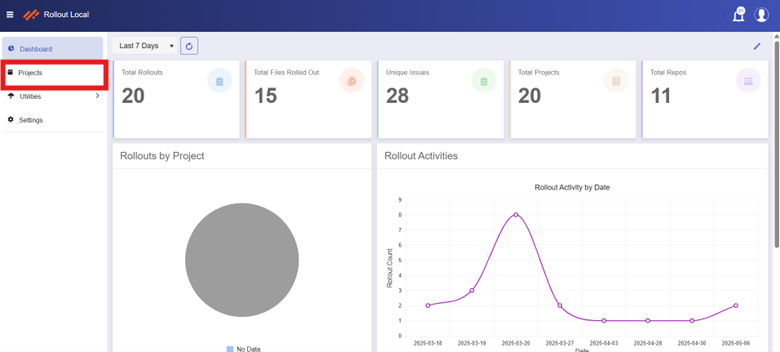
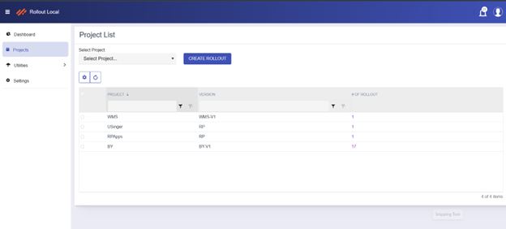
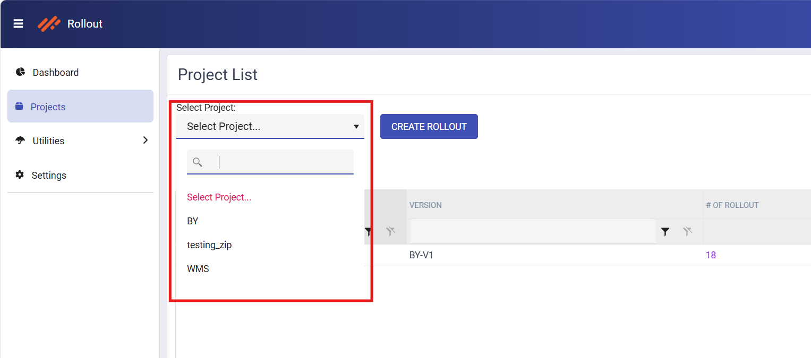
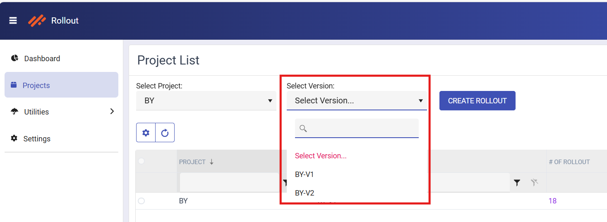
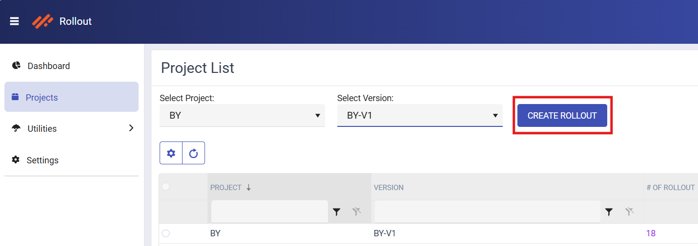
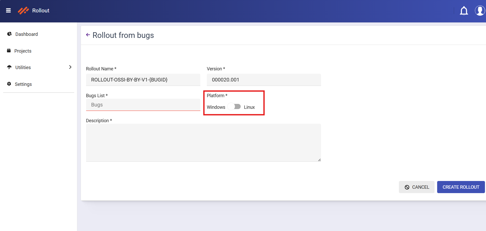
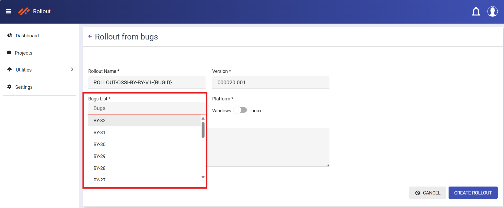
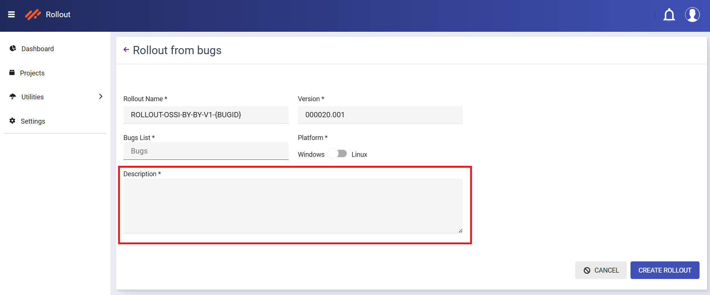
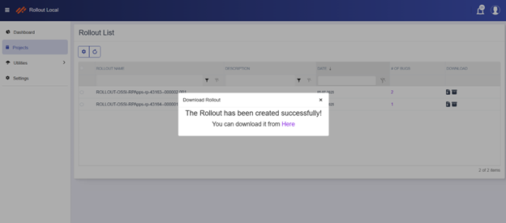
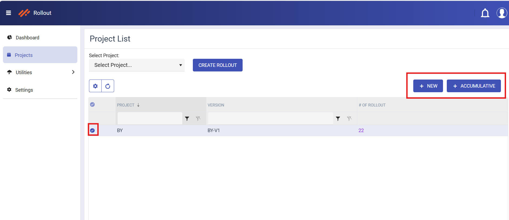

# Rollout Actions
In this section, you will learn how to create a new rollout, delete an existing one, regenerate one, and view detailed information related to each rollout.

## Project List

From the Dashboard, navigate to the **Projects** screen using the main sidebar.

 

    
      

This screen provides an overview of ongoing rollout activities and acts as the starting point for initiating new rollouts.

 

    
      

      
### Steps to Create a New Rollout

1. Select the required project from the **Select Project** dropdown.

 

    
      

2. Choose the appropriate version from the **Version** dropdown.

    

    
      

3. Click the **Create Rollout** button to proceed.

    

    
      

After clicking Create Rollout, you’ll be redirected to the Create Rollout page. Follow the steps below to complete the process:

4. On the Create Rollout page, choose the platform by selecting either Windows or Linux.

      

5. From the **BugList** dropdown, select one or more relevant bug IDs to associate with the rollout.

    

    
      

6. Enter a brief description in the **Description** text box.

   

    
      

7. Finally, click the Create button to complete the rollout setup.

8. Once the rollout is created, a **success message** will appear on the screen. You can then download the rollout by clicking the text link that says

     'You can download it from here.' 

   

    
      

    

### Alternative Flow
You can also create a rollout directly from the Project List without using the dropdowns.

To do this:

1. Select a row from the existing list of projects and versions.

2. Once selected, the top toolbar will display two options: New and Accumulative.

    **New Rollout** creates a rollout based on the current selection.

    **Accumulative Rollout** gathers all issues previously used to create rollouts for the selected project and combines them into a single rollout.

    

    
      

    
3. Click either New or Accumulative, depending on the type of rollout you want to create.

4. After clicking, you will be redirected to the [Create Rollout](#steps-to-create-a-new-rollout) page where you can complete the rollout setup.