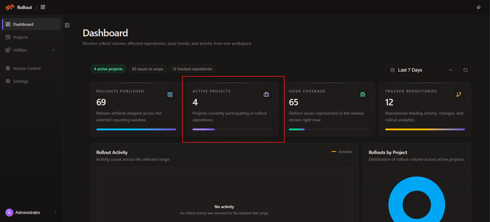
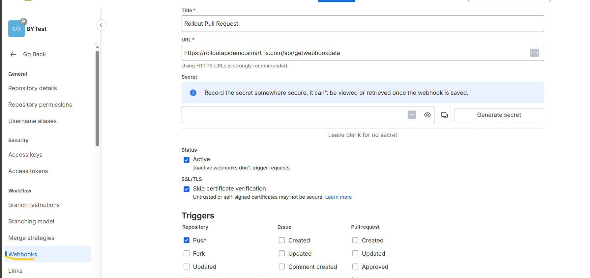
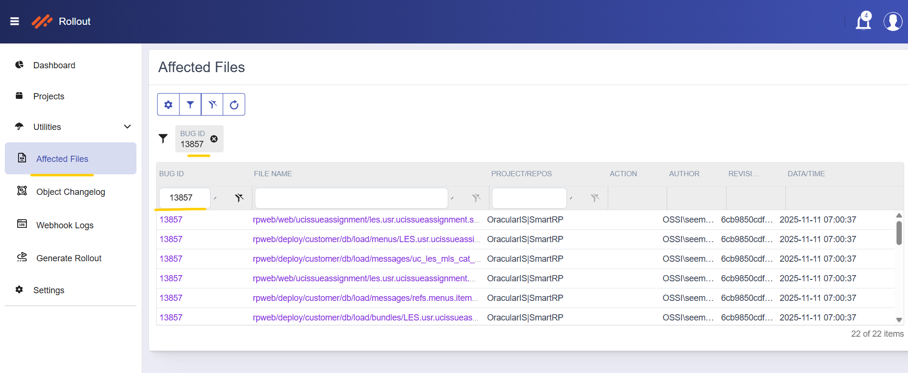
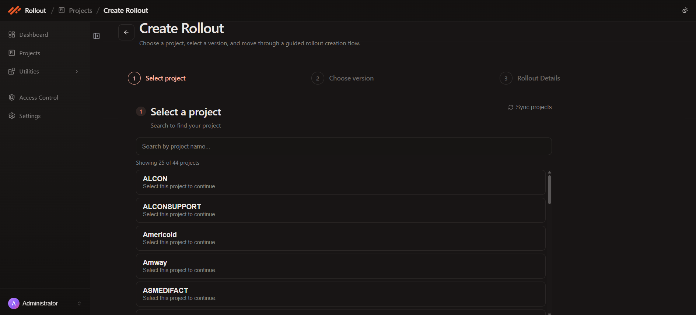
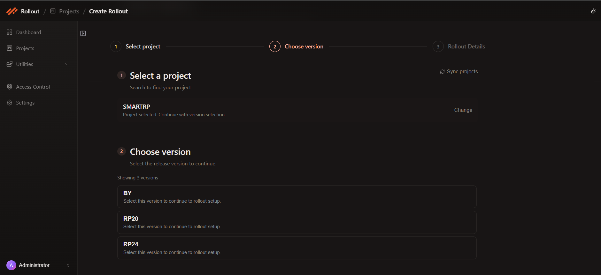
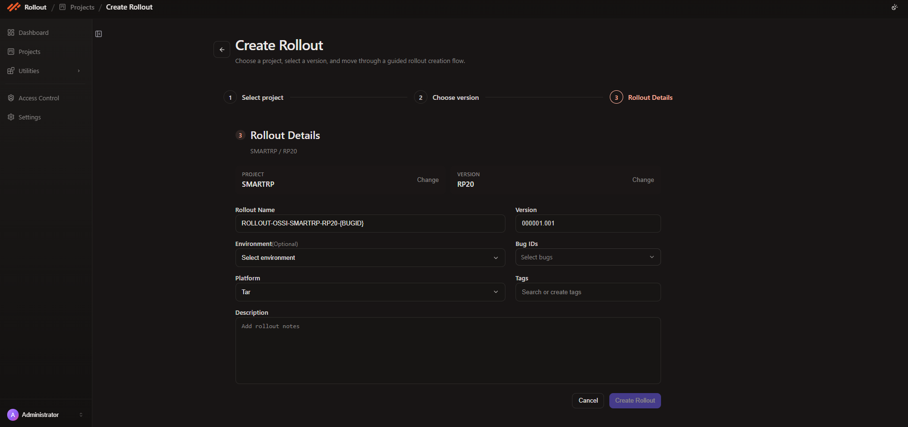
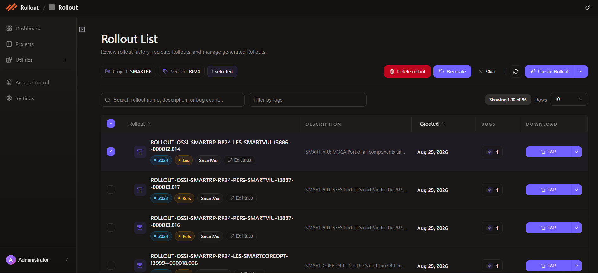

# Rollout Application Flow

Learn how to configure and use the Rollout Application to efficiently manage rollouts and track changes.

## 1. Configure the Rollout Application

Before using the application, configure the following providers:

- **Issue Management Provider**
- **Version Control Provider**

Once configured, the Dashboard will display all available projects.



## 2. Repository Setup

### 2.1 Create or Use an Existing Repository

- **New Repo:** Create a new repository in your version control system.
- **Existing Repo:** Ensure you have access to configure webhooks.

### 2.2 Configure Webhook

1. Go to **Repository Settings -> Webhooks**.
2. Enable the **Push Event**.
3. Set the Webhook URL to:

```
{base_url_backend}/api/getWebhookData
```



## 3. Work on Your Local Machine

### 3.1 Clone the Repository

```bash
git clone <repository_url>
```

### 3.2 Create and Checkout a New Branch

```bash
git checkout -b feature/your-feature-name
```

### 3.3 Make Changes

- Add or modify files according to your requirements.

### 3.4 Commit Changes

- Commit message format:

```
issue-number issue-description
```

- Example:

```
BY-123 Update user commands
```

### 3.5 Create Pull Request

1. Push your branch to the remote repository.
2. Create a Pull Request (PR) and merge it into the **main branch** after approval.

## 4. Verify Changes

After merging the PR, open the **Affected Files** page to confirm that Rollout captured your repository changes:

1. Open `http://localhost:8080/affectedfiles`.
2. In deployed environments, use `{base_url_frontend}/affectedfiles`.
3. Or navigate from the left menu using **Utilities -> Affected Files**.
4. Use the search bar to filter by values such as `bug:13887`, `file:debug.js`, `path:customer/db`, or `repo:SmartRP`.
5. Confirm your bug appears in the results, then review the repository, author, timestamp, and **files changed** count.
6. Click the row action on the right to inspect the affected files before creating the rollout.



## 5. Create a Rollout

The latest Rollout screen uses a guided 3-step wizard: **Select project**, **Choose version**, and **Rollout Details**.

### 5.1 Select a Project

1. Open the **Projects** page.
2. Click **Create Rollout** from the page toolbar or start from the rollout action on a project row.
3. In **Step 1 - Select project**, use **Search by project name...** if needed.
4. Click the project you want to use for this rollout.
5. Use **Sync projects** if the project list needs to be refreshed first.



### 5.2 Choose a Version

1. In **Step 2 - Choose version**, review the selected project shown at the top.
2. Click the release version you want to use.
3. If needed, use **Change** to go back and pick a different project before continuing.



### 5.3 Complete Rollout Details

1. In **Step 3 - Rollout Details**, review the selected **Project** and **Version**.
2. Fill in or review the available fields:

- **Rollout Name**
- **Version**
- **Environment** *(Optional)*
- **Bug IDs**
- **Platform**
- **Tags**
- **Description**

3. Use **Change** beside **Project** or **Version** if you need to go back.
4. Click **Create Rollout** to generate the rollout.



### 5.4 Download the Rollout

1. After the rollout is created, open the **Rollout List** for the selected project and version.
2. Use the **TAR** button in the **Download** column to download the package.
3. If needed, use the button dropdown to download the ZIP version instead.



## Tips & Best Practices

- Use descriptive commit messages linking to the issue number.
- Verify webhook configuration to avoid missing commits.
- Keep branches small and focused for easier pull requests and rollouts.
- Use the Affected Files page to double-check changes before creating a rollout.
