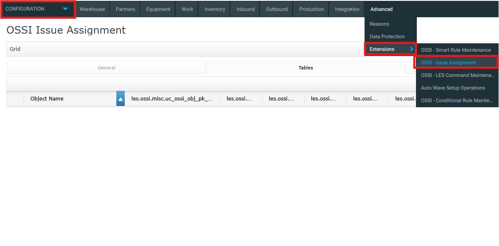
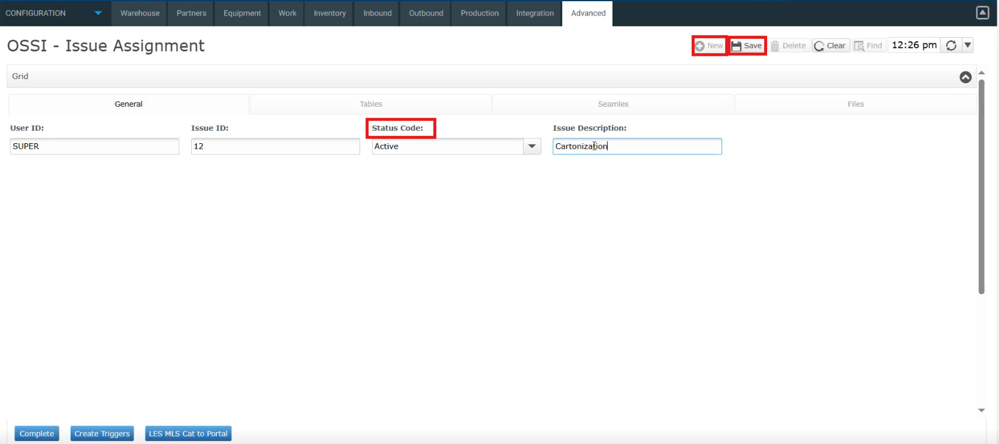
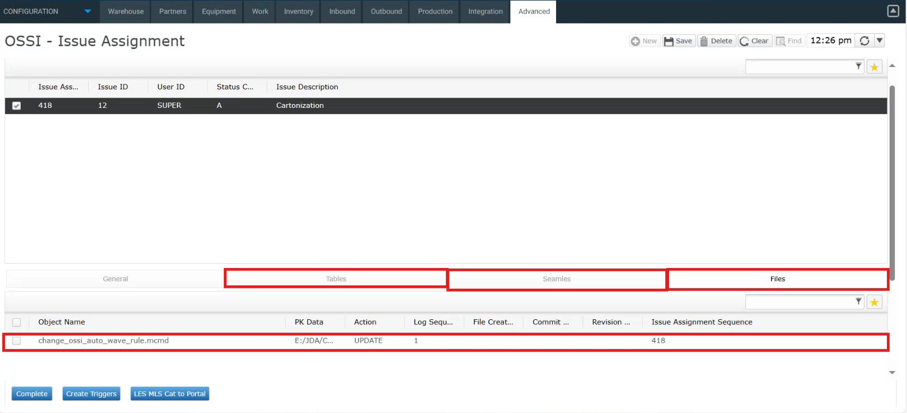
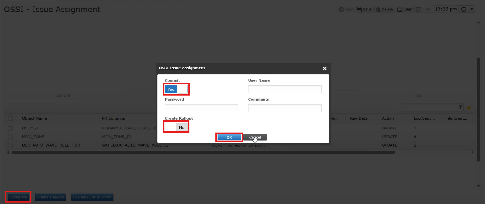
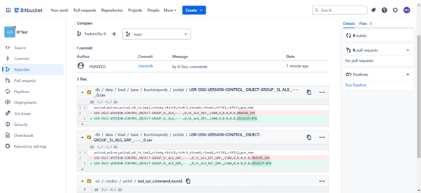
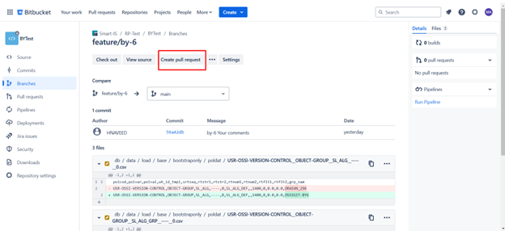
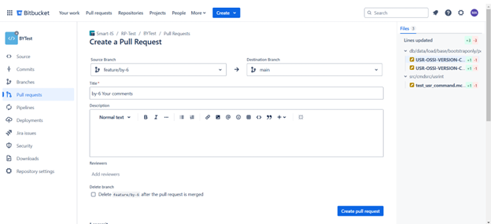
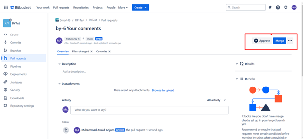

# Setup Guide 
This guide will walk you through how to properly set up and manage tracking in Smart DevOps. Whether you're assigning issues, enabling policies, or working with regular objects, everything you need to know is right here.

## Control Tracking
With Smart DevOps, you're not just pushing changes blindly. Every step is tracked, giving you full visibility into what’s happening and when. This means you’ll always know:

Who’s working on what — You can see exactly when an issue was assigned and to whom.

What changes are being made — Every edit, create, delete, or deployment is recorded.

### Global Tracking Setting

  Before you dive into the work, make sure global tracking is properly set up. These settings apply across your entire environment, so they’re really important.

  - **Overall Setup**
    
    To properly initialize tracking in Smart DevOps, you need to configure the overall setup and **enable the required policies**, especially the SETUP policy. This is essential for Smart DevOps to begin managing and monitoring changes effectively.

    Make sure the following policy is set up as shown:

    | `polcod`                  | `polvar` | `polval` |
    |---------------------------|----------|----------|
    | USR-OSSI-VERSION-CONTROL | SETUP    | ENABLED  |

    Without enabling the `SETUP` policy, Smart DevOps will **not** begin tracking changes, so be sure this is the first step in your configuration.

  - **Enable tag for any object**

    If you want to start tracking a specific object in Smart DevOps, you must first enable **object tracking**. 

    Here's an example to enable it:

    | `polcod`                  | `polvar`                 | `polval` |
    |---------------------------|--------------------------|----------|
    | USR-OSSI-VERSION-CONTROL | OBJECT-TABLE-AREMST      | ENABLED  |

    Once this policy is enabled:
    - All changes made to the object (e.g. aremst) will be logged.
    - The object becomes part of your issue tracking and deployment workflow.
    - You ensure traceability and version control for every update.


### Regular Objects - without identity columns

  In Smart DevOps, you can track all changes for regular objects that do not have identity columns.

  This means even if a table or object doesn’t use an auto-generated primary key, Smart DevOps is still capable of capturing and versioning every update made to it.

### Regular Objects - with identity columns

  Similarly, objects with identity columns (such as auto-incrementing primary keys) are fully supported.
  Smart DevOps will track row insertions, updates and eletions
  based on the identity column, ensuring precise version control.

### Integrator Objects

  Smart DevOps also tracks all the changes made through integrator. 

  No extra configuration needed — as long as tracking is enabled for the related object, all integrator-related changes will be captured automatically.

### Special Use Cases
  - **Disable issue tracking in the middle of transaction**
    
    Smart DevOps gives you flexibility when it comes to tracking changes — and one of the powerful features is the ability to **disable issue tracking in the middle of a transaction**.

    This is especially helpful when:

    - You don’t want to track every step of a complex operation.
    - You only care about the final outcome of a transaction —  not the entire chain of changes that lead up to it.
  
    Lets say you are creating a warehouse, there might be automatic generation of zones, areas and locations.
      
     But what if you only care about tracking the creation of the **warehouse itself**, and not all the related sub-elements?

      With this feature, you can **disable tracking temporarily** while the transaction is in progress by enabling the policy for it.

      Hers's the policy you need to set
      | `polcod`                  | `polvar`          | `polval`          |
      |-------------------------|------------------|------------------|
      | USR-OSSI-VERSION-CONTROL | OBJECT-TABLE-WH  | DISABLE-ON-CHANGE |

     Similarly, you can stop tracking while deleting a warehouse by setting the policy mentioned below

      | `polcod`                  | `polvar`          | `polval`          |
      |-------------------------|------------------|------------------|
      | USR-OSSI-VERSION-CONTROL | OBJECT-TABLE-WH  | DISABLE-ON-REMOVE |

      This gives you a clear, high-level tracking without cluttering your issue logs with unnecessary low-level operations.
  
  - **Excluding subset of data during tracking**

    Smart DevOps provides flexibility when it comes to excluding specific pieces of data from tracking.

    There may be situations where you don’t want every field or change to be tracked — for example, when certain columns like **descriptions or timestamps** are not critical to your version history.

    - **How to do it for policies**
    
      If you want to skip tracking for specific fields, you can simply **disable the policy** associated with that field like
      | `polcod`                  | `polvar`                            | `polval`   | `rtstr1`                        |
      |-------------------------|------------------------------------|----------|----------------------------------------|
      | USR-OSSI-VERSION-CONTROL | OBJECT-TABLE-POLDAT       | EXCLUDE-POLCOD | ALLOC-LOC-LOCK|

    - **How to do it for dscmst**

       If you don’t want to track the **DESCRIPTION** field (or any specific field), you can simply **disable the policy** related to that field.

      Here's an example:
       | `polcod`                  | `polvar`                            | `polval`   | `rtstr1`                        |
      |-------------------------|------------------------------------|----------|----------------------------------------|
      | USR-OSSI-VERSION-CONTROL | OBJECT-TABLE-DSCMST      | EXCLUDE-COLNAM | wh_id|

  - **How It Works Generally**

     You can control what gets tracked by configuring tracking policies. These policies define which tables, columns, or objects should be excluded from version control.

    If you want to exclude specific data entries in a table like LOCMST, add a policy that excludes the required fields or keys based on your use case.
To exclude specific data, you simply disable or modify the policy associated with it.
---
## Building Rollouts Without Integrated Version Control
Smart DevOps enables change tracking by issue assignment of a specific issue through GUI, ensuring accountability and control across all environments — whether Legacy, Web, or MOCA Client. 

The steps below will guide you through how the issue assignment process works in the GUI, helping you track changes effectively and with ease. 

1. Navigate to **Configuration → Extensions → OSSI – Issue Assignment** to access the Issue Assignment screen. 

   
    <div style="text-align: left;">
     
      </div>

2. To create a new issue assignment, click on New, then enter the User ID and Issue ID. Select the appropriate Status Code—Active, Inactive, or Complete. Please note that tracking is only performed for issues marked as Active. Add a brief Issue Description and click Save to complete the assignment. 

   
    <div style="text-align: left;">
     
       </div>

- Each screen or environment allows only one active issue at a time to maintain clarity and traceability. 

- Users can view assigned issues, making it easy to identify who is responsible for a change. 
 
 3. Any changes made are recorded on the Issue Assignment screen. Modifications to commands are logged in **Files** with the corresponding object name, data changes in Integrator are logged in **Seamles** while changes made through GUI or MOCA are reflected in **Tables** 

    <div style="text-align: left;">
     
      </div>

 4. To finalize an issue, first click **Complete**. Then, based on what you need, choose the appropriate options. If you only want to commit your changes to the connected repository, enable the **Commit** option. If you only want to create a rollout without committing the changes, enable the **Rollout** option. If you want to do both—commit and create a rollout—make sure to enable both options. Once all required fields are filled, click **OK** to complete the process.

    <div style="text-align: left;">
      
      </div>

- Change tracking can be disabled when necessary, offering flexibility in specific scenarios.  

- The system supports granular control over tracking policies (e.g., dscmst, configuration flags). 

- Unauthorized changes are prevented unless they are explicitly linked to an assigned issue, enforcing discipline in the development workflow. 

---

## Version Control Integration
SmartDevOps integrates seamlessly with Git-based version control systems to help you manage and track changes effectively. This section will walk you through how to create a new Git branch, commit your changes, and verify them in Bitbucket.

### GIT

#### Create a New Git Branch

  Follow these steps to create a new Git branch for your issue and start working in a structured way.

   1. **Organize your workspace**

      - On your server, navigate to the `gitbx` repository.
      - Create a folder with your **username**.
      - Inside that folder, follow this structure:

        **project-name -> Master folder**

         Replace `project-name` with the actual name of your project (e.g., `bytest`).
    
  2.  **Clone the Repository**
  
      - Clone the repo inside your project directory:
    
        ```bash
        git clone <repository-url>
        ```
      
         Replace repository-url with the actual Git URL provided to you.

  3. **Create a New Branch**

      - Use the pp.sh script to create a new Git branch in your working directory. The branch should have the same name as the Jira issue you're working on.

#### Commit Changes in OSSI Issue Assignment

  After completing your development changes, you can now commit changes in Issue Assignment.

  To learn more about Issue Assignment, follow [Issue Assignment](#building-rollouts-without-integrated-version-control)

#### Verify the Commit in Bitbucket

  Once you’ve committed your changes, you can verify them directly in Bitbucket:

  1. Navigate to your Bitbucket repository.
  2. Locate the branch you committed to.
  3. Open the branch to confirm that your changes are visible and correctly committed.

  This helps ensure that your version control actions were successful and that your work is properly synced with the repository.


#### Create a Pull Request

  To create a pull request follow these steps:

  1. Navigate to the BitBucket screen. 

     <div style="text-align: left;">
     
      </div>

  2. Click on Create pull request for your branch.

     <div style="text-align: left;">
     
      </div>
     
     Now click on Create pull request.

     <div style="text-align: left;">
     
      </div>

  3. Review the code changes shown in the diff view.
  4. Submit the pull request for review.
  5. Approve and merge the pull request into the main branch.
   
     <div style="text-align: left;">
      
     </div>
     

---

<br><br>