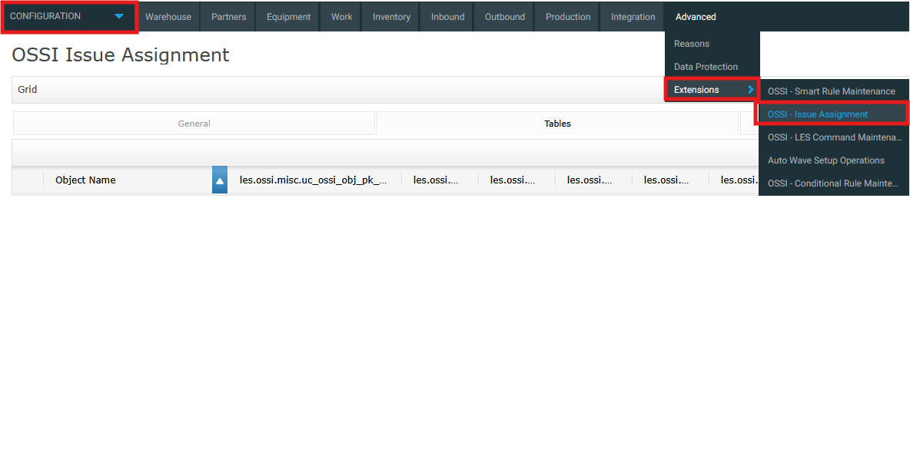
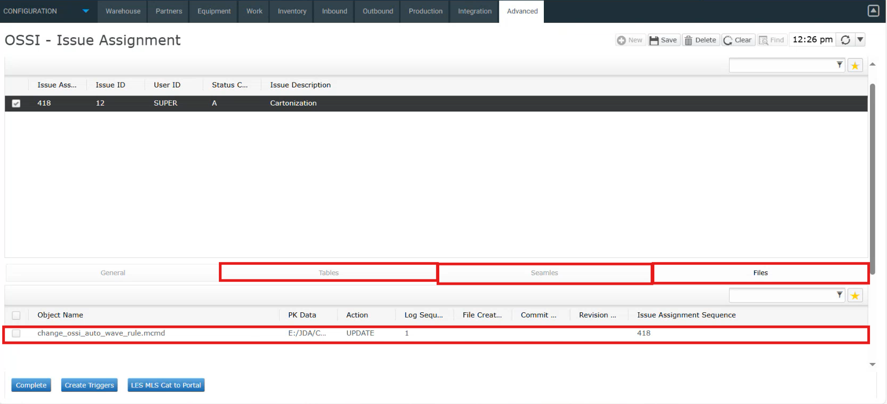
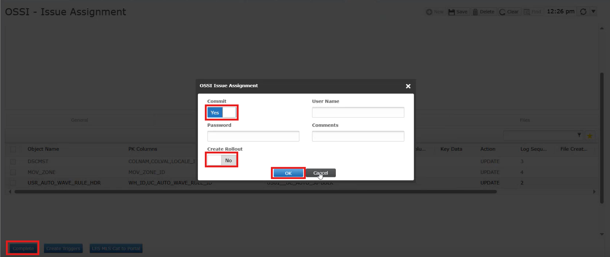

# Building Rollouts Without Integrated Version Control
Smart DevOps enables change tracking by issue assignment of a specific issue through GUI, ensuring accountability and control across all environments — whether Legacy, Web, or MOCA Client. 

The steps below will guide you through how the issue assignment process works in the GUI, helping you track changes effectively and with ease. 

1. Navigate to **Configuration → Extensions → OSSI – Issue Assignment** to access the Issue Assignment screen. 

   
    

     
      

2. To create a new issue assignment, click on New, then enter the User ID and Issue ID. Select the appropriate Status Code—Active, Inactive, or Complete. Please note that tracking is only performed for issues marked as Active. Add a brief Issue Description and click Save to complete the assignment. 

   
    

     
       

- Each screen or environment allows only one active issue at a time to maintain clarity and traceability. 

- Users can view assigned issues, making it easy to identify who is responsible for a change. 
 
 3. Any changes made are recorded on the Issue Assignment screen. Modifications to commands are logged in **Files** with the corresponding object name, data changes in Integrator are logged in **Seamles** while changes made through GUI or MOCA are reflected in **Tables** 

    

     
      

 4. To finalize an issue, first click **Complete**. Then, based on what you need, choose the appropriate options. If you only want to commit your changes to the connected repository, enable the **Commit** option. If you only want to create a rollout without committing the changes, enable the **Rollout** option. If you want to do both—commit and create a rollout—make sure to enable both options. Once all required fields are filled, click **OK** to complete the process.

    

      
      

- Change tracking can be disabled when necessary, offering flexibility in specific scenarios.  

- The system supports granular control over tracking policies (e.g., dscmst, configuration flags). 

- Unauthorized changes are prevented unless they are explicitly linked to an assigned issue, enforcing discipline in the development workflow. 

---

  