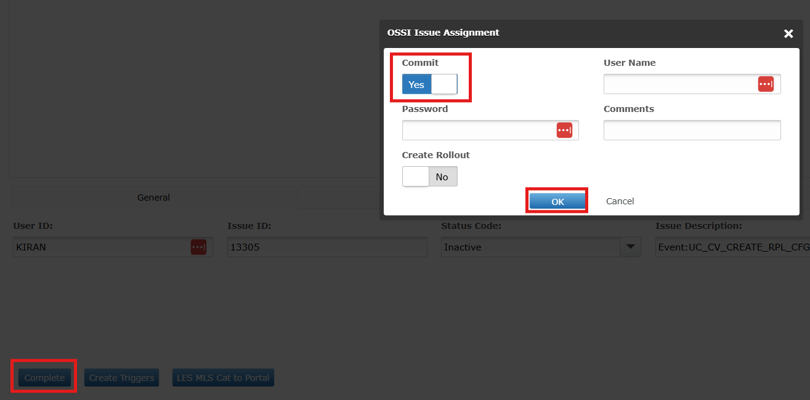
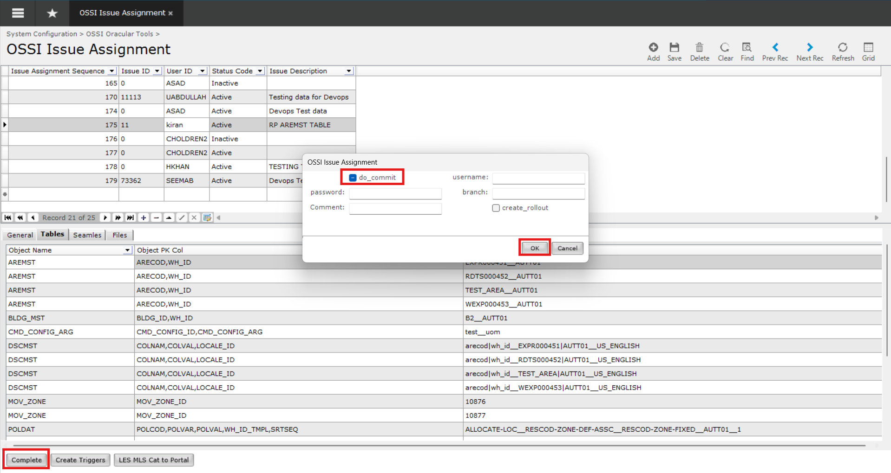

# Use Cases

## Code Changes
- When code is changed directly through the MOCA Client, the version control system automatically tracks these changes.
- This includes any script, logic, or configuration modified within the client interface

## Data Changes 
- Any data change made through the portal or directly from the MOCA Client is logged and tracked by Smart DevOps.

- This is because all data operations are ultimately executed through underlying MOCA commands, regardless of the interface used.

- Whether you're inserting, updating, or deleting data, if it’s done through a command — it’s getting tracked.

## Integrator Changes
- Similarly, any changes performed via integrators are also tracked — provided the underlying action triggers a MOCA command.
- Changes made to integrator components such as events, IFDs (Interface Definitions), mappings, etc., are also tracked by Smart DevOps.
- This ensures that integrations are version-controlled and traceable just like code and data.

## View Changes 
You can view the changes from any of the following interfaces:
- **From Portal**

    To view tracked changes from the thin Client, follow these steps:

    1. Navigate to **Configuration → Extensions → OSSI – Issue Assignment** to access the Issue Assignment screen. 

         
    
     2. Select the specific issue or user ID for which you want to review the changes.
    You can also search for the issue or user ID by adding them in the General tab.
         
    
    3. Once selected, the related changes are categorized into the following tabs:

        - **Files Tab:** Displays changes related to **MOCA scripts** and backend logic.
        - **Seamless Tab:** Shows all **integrator-related** changes (such as events, IFDs, etc.).
        - **Tables Tab:** Lists changes related to the **GUI** and front-end configurations.

        
- **From Fat Client**

    To view tracked changes from the Fat Client, follow these steps:

    1. Navigate to the  **OSSI Issue Assignment** screen.

       

    2. Select the specific issue or user ID for which you want to review the changes.
    You can also search for the issue or user ID by adding them in the General tab.

       
    
    3. Once selected, the related changes are categorized into the following tabs:

        - **Files Tab:** Displays changes related to MOCA scripts and backend logic.
        - **Seamless Tab:** Shows all integrator-related changes (such as events, IFDs, etc.).
        - **Tables Tab:** Lists changes related to the GUI and front-end configurations.

       

 
        
This structured view helps in identifying and verifying all changes made in the context of a particular issue or user activity.

## Generating new Triggers

- **From Portal**

    To create rollout from the thin Client, follow these steps:
    
    1. Navigate to **Configuration → Extensions → OSSI – Issue Assignment** to access the Issue Assignment screen.

         
    
    2. Select the specific issue or user ID for which you want to review the changes.
You can also search for the issue or user ID by adding them in the General tab.

         

- **From Fat Client**

    To generate new triggers from the Fat Client, follow these steps:

    1. Navigate to the **OSSI Issue Assignment** screen.
       
    
    2. Select the specific issue or user ID for which you want to commit the change.
    You can also search for the issue or user ID by adding them in the General tab.

        

    3. To generate new **triggers**, click **Create Triggers** button.
     

## Create Rollout 
You can create Rollout from any of the following interfaces:
- **From Portal**

    To create rollout from the thin Client, follow these steps:

    1. Navigate to **Configuration → Extensions → OSSI – Issue Assignment** to access the Issue Assignment screen. 

         
    
     2. Select the specific issue or user ID for which you want to review the changes.
    You can also search for the issue or user ID by adding them in the General tab.
         
    
    3. To finalize an issue, first click **Complete**. If your goal is to create a rollout, **enable** the **Create Rollout** option. Once all required fields are filled in, click **OK** to proceed. This action will generate a rollout in the backend.

         

- **From Fat Client**

    To create rollout from the Fat Client, follow these steps:

    1. Navigate to the  **OSSI Issue Assignment** screen.

       
    
    2. Select the specific issue or user ID for which you want to create the rollout.
    You can also search for the issue or user ID by adding them in the General tab.

       
    
    3. To finalize an issue, first click **Complete**. If your goal is to create a rollout, **enable** the **create_rollout** option. Once all required fields are filled in, click **OK** to proceed. This action will generate a rollout in the backend.
       
    

## Committing
You can commit your changes from any of the following interfaces:

- **From Portal**

    To create commit changes from the thin Client, follow these steps:

    1. Navigate to **Configuration → Extensions → OSSI – Issue Assignment** to access the Issue Assignment screen. 

         
    
     2. Select the specific issue or user ID for which you want to review the changes.
    You can also search for the issue or user ID by adding them in the General tab.
         
    
    3. To finalize an issue and commit your changes, first click **Complete**. If you only want to commit the changes to the connected repository (such as Git or Bugzilla), **enable** the **Commit** option. Make sure all required fields are properly filled out. Then click **OK** to complete the process. This will push the committed changes to the selected repository under the specified issue.

         

- **From Fat Client**

    To commit changes from Fat Client:

    1. Navigate to the  **OSSI Issue Assignment** screen.

       
    
    2. Select the specific issue or user ID for which you want to commit the change.
    You can also search for the issue or user ID by adding them in the General tab.

       

    3. To finalize an issue and commit your changes, first click **Complete**. If you only want to commit the changes to the connected repository (such as Git or Bugzilla), **enable** the **do_commit** option. Make sure all required fields are properly filled out. Then click **OK** to complete the process. This will push the committed changes to the selected repository under the specified issue.
    
        

